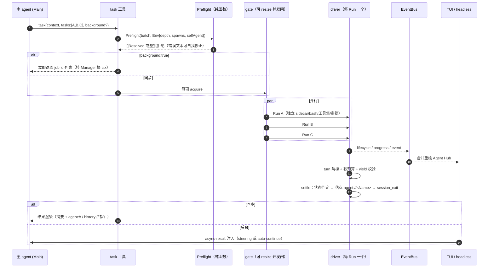
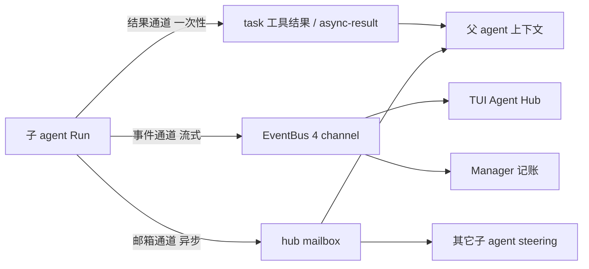
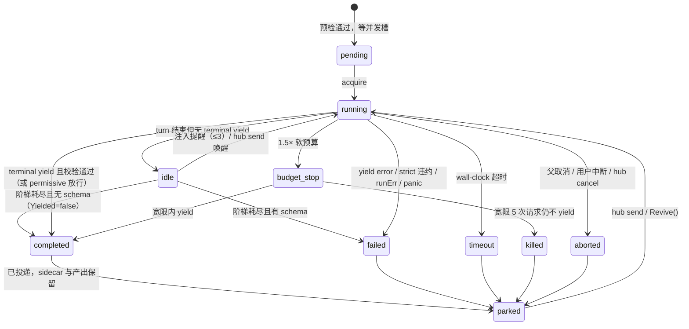

# codeclaw 架构总结（当前实现态）

> 日期：2026-08-24 · 对象：`my_code_agent`（模块 `einoclaw-build`，agent 名 codeclaw）
> 代码基线：分支 `phase-8-foundation-fixes`，HEAD `6d3e9f2`（P9.3）+ 工作区未提交的 P9.4（hub / jobs / mailbox / 后台投递）
> 状态核对：`go build ./... && go test ./...` 全绿（含未提交部分）
> 维度：Agent 架构 · 委派与并行 · 通信与完成度 · 失败控制 · 多会话 · 记忆 · 长上下文 · 工具治理 · 评测审计
> 本文只描述**已经落进代码的东西**，并在每节末尾标注「尚未落地」的部分；设计意图见 [演进方案](2026-08-24-evolution-plan.md) 与 [Phase 9 详设](phase-9-delegation-runtime.md)。

---

## 0. 一句话概括

codeclaw 是一个**手写的、事件驱动的编程 agent harness**：eino 只被关在 `internal/model` 一个包里当模型客户端；harness 的每个子系统都围绕三条承重不变量组织——**事件驱动的三层循环**、**追加式 JSONL 是唯一真相源**、**Tool/Runtime 分离 + 纯函数审批**。

在这三条之上，M2（Phase 9）把"派发子 agent"从一次同步函数调用，升级成了**一组有契约、可观察、可干预、寿命受约束的执行单元**——这是当前项目最厚的一层，也是问题里"派发 / 通信 / 完成度 / 失败控制"四问的答案所在。

---

## 1. 整体架构与包依赖

```
einoclaw-build/
├── cmd/agent/            装配层：配置三层合并、项目桶、工具工厂、Manager、TUI/headless 入口
├── cmd/eval/             评测入口
└── internal/
    ├── message/          共享消息类型（零依赖：Role + ContentBlock{text/thinking/tool_call/tool_result}）
    ├── model/            【唯一 import eino 的包】流式模型客户端 + Usage + 错误分类
    ├── agent/            事件驱动循环（run/turn/step）+ AgentEvent + 流累积器 + Context 接口
    ├── session/          追加式 JSONL 会话（entry 树 / 回放 / 压缩条目 / fork）+ 多会话 Manager
    ├── context/          上下文真相源：Build/Record/ShouldCompact/Compact/RecoverOverflow
    ├── memory/           SQLite + FTS5 多信号召回
    ├── tool/             Tool 接口 + Registry + Executor（审批 + 并发 + 截断）+ MCP 桥
    ├── runtime/          Sink（截断落盘）+ ArtifactStore（URL 路由）+ Bash（每实例独立 cwd）
    ├── permission/       纯函数审批策略（tier × mode）
    ├── bus/              进程内发布订阅（非阻塞，满即丢）
    ├── subagent/         委派运行时：发现/预检/驱动/yield/schema/名册/邮箱/后台作业/hub/task
    ├── trace/            JSONL 聚合统计
    ├── eval/             夹具 + 字节 diff
    ├── paths/            数据落点：$CODECLAW_HOME、按 cwd 分桶的项目目录、项目身份
    └── tui/              BubbleTea TUI + markdown 渲染 + 审批弹窗 + Agent Hub 面板
```

依赖方向单向无环：`cmd` → `agent`/`subagent` → `{model, session, context, memory, tool, permission, runtime, bus}` → `message`。

**装配是唯一把它们粘起来的地方**（`cmd/agent/main.go:147`）：一个 `workerTools` 工厂（`main.go:208`）保证**每个调用方拿到自己的 bash 实例与工具注册表**，这是"子 agent 真并行"的物理前提。

---

## 2. Agent 架构：三层循环与真相源

### 2.1 循环形状

`agent.Agent` 是薄的：`{name, model, tools, executor, cc, maxIterations, maxRetries, retryBase}`。真正的状态全在 `cc`（`agent.Context` 接口，`internal/agent/agent.go:15`）里：

```go
type Context interface {
    Build(ctx) ([]message.Message, error)   // 每一步重建模型输入（不持有私有 msgs 切片）
    Record(m, usage) error                  // 落进 session
    ShouldCompact(usage) bool               // provider usage 为真值
    Compact(ctx) (bool, error)
    RecoverOverflow(ctx) (bool, error)
}
```

这个接口就是"长上下文治理"与"循环"的解耦点：生产实现是 `context.Manager`（包着 session），测试用 `MemoryContext`，子 agent 用自己的一份。

一次 `Run`（`internal/agent/loop.go:16`）吐出事件流，`loop`（`loop.go:36`）每一步做五件事：

1. **steering**：非阻塞从 `steer` 通道取修正消息，记录为用户消息（`loop.go:41`）——这是父 agent / hub 消息 / 预算通知注入运行中 agent 的唯一入口。
2. **mid-turn 压缩**：上一步 usage 超阈值就在**下一次模型调用之前**压缩（`loop.go:49`）；这修掉了"同一个 turn 里 20 次工具调用撑爆窗口无从恢复"。
3. **重建输入**：`cc.Build()`——不缓存私有切片，压缩/steering/子 agent 写入都能立刻反映。
4. **消费流**：`consumeStream`（`loop.go:149`）把 delta 累积成定稿消息（`state.go` 的累积器按 `Index` 合并工具调用分片），emit `MessageStart/Update/End`。
5. **执行工具**：`executor.ExecuteAll` 并行/串行执行 → **先把所有结果都 Record 完**再判终止（`loop.go:99-113`），保证 tool_call/tool_result 配对永不被拆。

终止判定读 `Result.Terminal`（**按本次调用**，不是按工具），这样 yield 的增量提交不终止、终止提交才结束 run。

### 2.2 错误分流

`handleModelError`（`loop.go:119`）把模型错误分三条互斥通道：

| 错误 | 处置 |
|---|---|
| ctx 取消 | 安静退出，不记空消息（`loop.go:77`） |
| 上下文溢出 | `cc.RecoverOverflow()` → 成功则 `continue`（本步不计数） |
| 可重试（429/5xx/网络） | 指数退避 `base·2^(n-1)`，≤3 次，emit `EventRetry` |
| 其它 | `EventError` 并退出 |

**溢出与重试互斥**是这里的关键设计：溢出不该走重试通道（重试同一个超长请求只会再失败一次）。

### 2.3 事件与 UI 解耦

`AgentEvent`（13 种类型，`internal/agent/event.go`）是循环与 UI 之间的唯一契约。TUI 与 headless 都只消费事件；emit 有 1s 超时保护（`loop.go:23`）——**丢事件只影响渲染，持久化已在循环内完成**。

---

## 3. 主 Agent 如何派发子 Agent（并行执行）

这是问题的核心。一次派发走完整的**预检 → 装配 → 驱动 → 结算 → 投递**五段。

### 3.1 派发链路



### 3.2 契约：TaskBatch + 预检（`preflight.go:36`）

`task` 工具参数是扁平三段：`{context, tasks[], background}`（`task.go:60`）。

- `context` 必填：**整批共享的 Goal / Constraints / Contract**——子 agent 看不到父历史，这是唯一的共享背景。
- 每项 `{name?, agent, task, output_schema?, schema_mode?, effort?}`，`task` 必须写 Target / Change / Acceptance。

`Preflight` 是**纯函数，先于任何子进程**，任一项不合格**整批拒绝**（半个批次跑起来更难收拾）：

1. `tasks` 空 / `context` 空 → 拒绝
2. `depth >= maxDepth`（默认 2）→ "这一层必须自己完成"
3. 未知 agent → 列出可用名单
4. 不在调用者 `spawns` 白名单 / 派发同名 agent → 拒绝（防无限外包）
5. **任务描述 < 40 字符 → 拒绝**，并告诉模型必须写 Target/Change/Acceptance ← 把"派发质量"变成硬约束
6. 运行名 sanitize 到 `[A-Za-z0-9_-]`、批内去重、且不与名册（含 parked）冲突
7. schema 优先级：`item.OutputSchema` > `def.OutputSchema`；mode 同理，缺省 `permissive`

失败返回的错误文本直接进模型上下文，**目标是让模型自己改对**，而不是让用户看日志。

### 3.3 agent 定义的发现（`discovery.go:28`）

三层 markdown frontmatter，同名 first-wins：

```
<cwd>/.codeclaw/agents/*.md   (project)
  → $CODECLAW_HOME/agents/*.md (user)
    → go:embed internal/subagent/agents/*.md (bundled: explorer/reviewer/planner/worker)
```

内置定义也是 markdown 走同一条解析路径（`Bundled()`，坏了直接 panic——启动即暴露）；用户文件坏了只 warn 跳过，**不影响其它 agent**。frontmatter 支持 `tools/spawns/model/output/schema_mode/max_turns/soft_budget/timeout/read_only/blocking`，`tools` 同时接受 CSV 与数组，非法 `timeout` 只降级该字段。

`task` 工具的 Description **动态枚举**当前可派发的 agent（带 `[READ-ONLY]`/`[BLOCKING]`/`[结构化产出]` 标记）+ 三句硬约束（自包含 prompt / yield 提交 / completed≠验收）。

### 3.4 每个 Run 的隔离装配（`manager.go:394` `buildRuntime` / `manager.go:426` `buildTools`）

| 维度 | 做法 | 解决什么 |
|---|---|---|
| **上下文** | 空白历史 + `<batch-context>` + `<task>` 两段（`manager.go:468`） | 父上下文不污染子；子只交还结论 |
| **会话** | 独立 sidecar `agent-<Name>-<rand>.jsonl` + 首条 `session_init`（记 agent/prompt/task/tools/schema/depth） | 可审计、可 `history://` 读、可 revive |
| **bash** | `runtime.NewBash(cwd)` **按 Run 新建**（`main.go:210`） | 一个子 agent `cd` 不再改变其它 agent 的 cwd；bash 上的并行是真的 |
| **工具集** | `def.Tools` 子集 → `read_only` 裁到 `read_file/glob/grep` → 强制加 `yield` + `hub` → 满足 spawns 且未到深度上限才加 `task` | 能力边界比 prompt 更硬 |
| **权限** | **继承父 mode**（不是 yolo）；默认 `denyApprover`（拒绝并说明）；`approval_escalation: true` 才用 `labeledApprover` 升级到父弹窗 | 派发 ≠ 放行；审批边界不被绕过 |
| **产物** | 每 Run 一个 `ArtifactStore`（同一会话目录），并注册 `agent://`/`history://` | 子 agent 之间也能互读产出 |
| **强制收尾备用集** | 同时构造一个**只含 yield** 的注册表 + 执行器 | 强制 yield 不依赖 provider 的 tool choice，fake model 可测 |

### 3.5 并行与并发控制

- 同步批次：`RunBatch`（`manager.go:304`）为每项 `gate.acquire` → goroutine → `defer recover()` → **结果按输入序回填**；失败不互相拖累。
- 后台批次：`StartBackground`（`jobs.go:114`）挂 **Manager 自己的根 ctx**，不挂 task 工具调用的 ctx——否则父 turn 一结束（或用户 Esc）后台作业就被连带取消，"后台"名存实亡。定义里 `blocking: true` 的 agent 仍内联等待。
- `gate`（`jobs.go:19`）是**可运行时 resize 的并发闸**：令牌在固定容量通道里；缩容时取不到令牌就记一笔"债"，等在跑的 Run 归还时直接扣掉——**缩容不打断正在跑的任务**。上限 `min(配置, 64)`，默认 4。
- 工具层还有第二级并发：`Executor.ExecuteAll`（`executor.go:100`）对 `ConcurrencyShared` 工具并行（信号量 8），`ConcurrencyExclusive`（bash/write_file/yield）串行且等前面并行的完成。

---

## 4. 通信：三条通道，各管一件事

**设计原则：父 agent 只消费"结果通道"，绝不消费原始事件**（否则子 agent 的每一次工具调用都会污染父上下文）。



### 4.1 结果通道（子 → 父，恰好一次）

yield 产出 → schema 校验 → **完整产出落盘** `agent://<Name>`（`driver.go:384`）→ 父只拿渲染摘要 + 两个指针行（`task.go:181`）：

```
## Reviewer (reviewer) [completed] requests=7 tools=12 tokens=18342 9231ms
{ "findings": [...], "verdict": "..." }
(完整产出: agent://Reviewer)
(转录: history://Reviewer → …/agent-Reviewer-3f9a1c.jsonl)
```

指针不是装饰：`read_file` 的 `file_path` 含 `://` 就交给 `ArtifactStore.Resolve` 路由（`artifact.go:86`、`tools.go:54`），`agent://` / `history://` / `artifact://` 三个方案共用**同一个读回入口**。名册里查不到（例如 resume 之后）会回落到产物目录 glob。

### 4.2 事件通道（子 → UI/Manager，流式，可丢）

`internal/bus` 是极简发布订阅：**Publish 永不阻塞，订阅者缓冲满就丢这一条**（`bus.go:31`）。语义取舍写在包注释里：总线只服务渲染与观测，真相源始终是会话 JSONL，丢事件不影响正确性。

四个通道（`driver.go:32`）：`subagent.lifecycle`（状态变化）、`subagent.progress`（当前工具/requests/tokens/提醒数/预算态）、`subagent.event`（原始 AgentEvent，留给"聚焦转录"）、`job.settled`、`hub.message`。

TUI 侧把四个通道**合并成一条重绘信号**（`tui/hub.go:28`），面板渲染时直接读 `mgr.Roster()` 快照——**不在 TUI 里维护第二份状态**，所以丢事件最多晚一帧，不会显示错。`ctrl+a` 打开 Agent Hub。

### 4.3 邮箱通道（父↔子、子↔子，异步）

`hub` 工具（`hub.go:63`）六个 op：

| op | 语义 |
|---|---|
| `list` | 列可寻址 peer（自己以外）+ 当前工具 |
| `send` | 投递；**running/idle → 注入对方 steering；已 parked → 唤醒续跑（后台作业）** |
| `inbox` | 非阻塞清空自己的信箱 |
| `wait` | 阻塞到第一个事件（新消息 / 关注的作业结束 / 超时 30s，上限 120s） |
| `jobs` | 作业快照，**已结束的行同时消费投递** |
| `cancel` | 按 id 取消 |

关键实现（`manager.go:175` `Deliver`）：主 agent 地址固定 `Main`，消息进主信箱由 TUI/headless 取件；运行中的子 agent **直接推它的 steer 通道**（不走信箱）；已结束的触发 `Revive`。消息渲染成 `[hub from X] …` 记进目标会话，**因此可审计**。

工具描述里明确写死："只用来协调，不要传长内容——文件用路径，产出用 `agent://`，截断输出用 `artifact://`"。

### 4.4 后台结果的投递：恰好一次

`pending` 队列 + 三个消费者共用同一个"未投递"集合（`jobs.go:173/199`）：

- `TakeSettled()`（TUI/headless 取件）
- `Jobs()`（模型调 `hub jobs` 时，看到结果即算投递）
- `hub wait` 的 `settledAmong`——**不关注的作业会 `putBack` 放回队列**（`hub.go:139`）

投递路径（`tui/tui.go:459` `deliverPending`）：主 agent 有活动 run → 作为 steering 注入下一步；空闲 → 落一行提示并 `startRun(notice)` 自动续跑。headless（`headless.go:29`）等作业结算（上限 `--wait-jobs`）后 auto-continue，**最多 3 轮**避免 CI 无限循环。

注入文本是 `<system-notice>` 包裹的作业结果 + 消息（`jobs.go:284`）。

---

## 5. 完成度保证：五层，层层收紧

问题里的"保证任务完成度"在代码里是五个独立机制的叠加：

### 5.1 契约层

预检拒绝一行 prompt、要求 batch context、要求 Acceptance（见 §3.2）。

### 5.2 协议层：yield 三态（`yield.go`）

线格式是**扁平三参数** `yield(data?, error?, section?)`，刻意不用顶层 `anyOf`（strict provider 会拒整个工具定义）。

| 组合 | 语义 | 终止 |
|---|---|---|
| `data`，无 `section` | terminal success | ✅ |
| `data` + `section` | incremental：累积到 `Sections[section]` | ❌（回"已记录，继续工作"） |
| `error` | 主动放弃并说明卡在哪 | ✅ |
| `data` + `error` | 参数错误 → 退回 | ❌ |
| 都没有但有分段 | 用分段装配最终 data | ✅ |
| 都没有且无分段 | 空提交，≤3 次，第 4 次判失败 | 第 4 次 ✅ |

`data` 参数的 wire schema 由 outputSchema **递归去掉 `required`** 派生（`deriveDataSchema`），加 `additionalProperties: true`——模型看得见目标形状，增量分段又不会在线格式上非法；**真正的校验（含 required）在工具内做**。

### 5.3 校验与重试（`yield.go:189` + `schema.go`）

内置一个"够用就好"的 JSON Schema 子集校验器：支持 `type`（含类型数组）/`required`/`properties` 递归/`items`/`enum`；**有意忽略** `$ref`/`oneOf`/`pattern`/`min-max`（误报代价高于漏报）。

- 校验不过 → 把**具体问题列表 + 剩余次数**作为工具 error 返回给模型（因此不终止），≤3 次
- 第 4 次：`permissive`（默认）→ 接受 + `SchemaOverridden` warning；`strict` → 记录 data 并判 `failed(schema_violation)`
- 增量分段：`sectionSchema` 命中就校验该段（数组属性取 items）；封闭 schema 下未知分段名退回并列出可用名

### 5.4 驱动层：turn 阶梯 + 软预算（`driver.go:198` `drive`）

```
for {
    turnCtx = WithCancel(runCtx)          // 每 turn 一个可单独取消的 ctx
    consume(agent(forced ? yieldOnly : tools).Run(turnCtx, steer))
    if terminal yield || runCtx.Err() || killed  { break }
    if budgetStopped { forced = true; 注入强制收尾通知; continue }
    if reminders >= 3 { break }
    reminders++; forced = (reminders == 3); 注入 idle 提醒
}
```

- **turn 结束但没 terminal yield = idle**，注入提醒（"只输出文本不会有任何结果回到主 agent"），最多 3 次；**第 3 次把工具集换成只有 yield**。
- **软预算三段式**（`driver.go:298` `checkBudget`）：`requests == soft` 推收尾通知（走 steer，不打断）→ `requests >= soft×1.5` 标 `budget_stop` 并**只取消当前 turn**（Run 继续活着去做强制收尾）→ 停机后再烧 5 次请求仍不 yield → `Cancel()` 硬杀。
- 配置只能**下调**不能上调 frontmatter 的 soft_budget（`manager.go:285`），避免一个自定义 agent 把护栏放大。
- 消费者必须**把事件通道读到关闭**再进下一 turn（`driver.go:227` 注释），否则两轮会并发写同一 session。

### 5.5 验收层

`task` 工具描述与主 agent 提示词都写死："**completed 只表示它结束了，不代表结果正确——你必须自己验收**"；内置 `reviewer` 是 `read_only` + `strict` schema 的专职验收 agent。`delegation_mode: always` 时主 agent 只保留只读工具 + task + remember（`main.go:246`），从能力上强制"自己不写代码，但能验收"。

---

## 6. 失败控制：状态机 + 处置表

### 6.1 状态机（`spec.go:44`）



### 6.2 判定优先级（`driver.go:331`，顺序即优先级）

```
父 ctx 取消 → aborted
killed      → killed（预算耗尽或人工取消）
budgetStopped && !terminal → killed
runCtx 超时 → timeout
runErr      → failed
yield error → failed
strict 违约 → failed(schema_violation)
terminal    → completed（可能带 override / 预算强制收尾 warning）
有 schema 但阶梯耗尽 → failed
无 schema 阶梯耗尽   → completed 且 Yielded=false，warning 说明"以下是最后输出"
```

这条链修掉了 P8 之前"超时/取消被报成 completed"的失真问题——**父 agent 不会再把半成品当成功结果综合**。

### 6.3 处置表

| 失败类型 | 处置 | 父看到什么 |
|---|---|---|
| 模型瞬时错误 | 循环内退避重试 ≤3 次 | 只在 trace/进度可见 |
| 子 agent 上下文溢出 | 它自己走 `RecoverOverflow` 后 continue | 不可见 |
| wall-clock 超时 | `runCtx` 超时 → `timeout`，保留 partial | `[partial]` + 最后文本 + 两个指针 |
| 软预算耗尽 | 通知 → 强制 yield → 宽限 5 次 → `killed` | `killed` + 已用请求数 + partial |
| schema 不符 | 工具内反馈重试 ≤3；permissive 放行 / strict failed | `warning` 或 `schema_violation` |
| 工具被权限拒绝 | 子 agent 收到 denied 文本继续；核心步骤被拒应 yield error | 阻塞描述 |
| 父取消 / Esc | ctx 传播 → `aborted`，transcript 保留 | 逐项 aborted |
| goroutine panic | Run 入口 `recover()` → `failed` + 堆栈 | failed + error |

**所有终态都进 `parked`**：名册保留（上限 100，超出丢最早的已结束项，磁盘不删），sidecar 与 `agent://` 产出仍可读，且可被 `hub send` / `/agent <Name> <文本>` 唤醒续跑（`Revive`，`jobs.go:241`）。续跑会 `resetForRevive()` 把预算与提醒**按这一次续跑重新计**（否则上次用满的预算会让新一轮一上来就被强制收尾），`Revives++`，结果按后台作业通道回投。

---

## 7. 多会话管理与项目隔离

### 7.1 数据落点（`internal/paths`）

```
$CODECLAW_HOME（默认 ~/.codeclaw）/
├── config.yaml                      用户级配置
├── agents/*.md                      用户级子 agent 定义
└── projects/<EncodeCWD>/            项目桶
    ├── project.json                 cwd / git root / first_seen / last_seen
    ├── memory.db                    本项目的记忆
    ├── current                      本项目的当前会话指针
    ├── 20260824-101500_8f2c1d.jsonl 会话
    └── 20260824-101500_8f2c1d/      该会话的产物目录
        ├── 0.bash.log               artifact://0
        ├── Reviewer.md              agent://Reviewer
        └── agent-Reviewer-3f9a1c.jsonl   history://Reviewer

<project>/.codeclaw/
├── config.yaml                      项目级覆盖
└── agents/*.md                      项目级子 agent 定义（最高优先级）
```

`EncodeCWD`（`paths.go:52`）先 `EvalSymlinks` 规范化：家目录下编码成 `-<相对路径>`，其余 `--<绝对路径>--`。**同一目录（含符号链接别名）落到同一桶，不同项目互不可见**——这解决了 P8 之前"所有项目的会话与记忆混在一个仓库目录"的根因。

配置三层合并（`config.go:61`）：用户 → 项目 → 仓库内 legacy `config.yaml`，后者覆盖前者非零值，MCP servers 累加。启动时检测仓库内旧 `sessions/`、`memory.db` 并提示一次（不自动迁移）。

### 7.2 Session：追加日志 + 可变 leaf 指针

`Entry` 带 `id/parentId/ts`，条目一旦写入不可变，**可变状态只有 leaf**（`session.go:104`）。条目类型：`session`(header) / `message` / `compaction` / `init` / `custom` / `title` / `reset`。

- **回放**（`replay.go:41` `buildContext`）：从 leaf 沿 `ParentID` 回溯（遇重复 id 终止防环）→ 取最新 `reset_boundary` 之后 → 展开最新 `compaction` 为 `[摘要] + 从 FirstKeptEntryID 起的消息` → **修复悬空 tool_call**（`replay.go:88`：没有配对结果的调用合成一条 `[interrupted: tool did not run]` 结果，仅回放不落盘）。这条修复是 Ctrl+C 之后 `/resume` 首个请求不再被 API 拒绝的原因。
- **压缩不重追加保留消息**：`Compact(summary, firstKeptID, tokensBefore)` 只写一条 compaction 条目（`session.go:194`），保留段靠 `FirstKeptEntryID` 指针引用，避免同一段消息在文件里出现两次。
- **Fork**：复制条目（保留 id 链）到新存储，header 带 `ParentSession`，父子此后互不影响。
- **多会话 Manager**（`session/manager.go`）：`Current/New/Switch(id前缀)/List`；`List` 只读每个文件**前 12 行**取标题/首条用户消息（`peek`），按 mtime 排序；`agent-` 前缀的 sidecar 不列出。`ArtifactDir(s)` = `<项目桶>/<会话id>/`。
- TUI 侧：`/new` `/sessions` `/resume` `/title` `/agents` `/agent <Name> <文本>`；切会话时 `cmgr.SetSession(ns)` 跟随，聊天区用 `Replay()` 重渲染。

**尚未落地**：自动标题（小模型生成）、lazy 创建 + 定宽 title slot、多实例 `flock` 独占、blob 外置。

---

## 8. 结构化记忆与"减少重复读取"

### 8.1 现状

`internal/memory` 是 SQLite（纯 Go 驱动 `modernc.org/sqlite`）+ FTS5 trigram：

- 表 `working_memory{content, source, veracity, importance, memory_type, created_at}` + 虚表 `memory_fts`，**两表写入用事务**避免 FTS 孤儿行。
- 召回是**纯代码多信号打分**（`retrieval.go:14`），不靠模型：
  `score = (0.5·归一化bm25 + 0.3·importance + 0.2·recency) × veracity`，recency 是 72h 半衰期指数衰减。
- **项目隔离靠目录分桶**：库文件是 `<项目桶>/memory.db`（`main.go:183`），所以"项目 A 的约定被召回到项目 B"这个问题已经通过 B1 的目录方案解决了，虽然表里还没有 `scope/project_id` 列。
- 写入入口是 `remember` 工具（`tool/memory_tool.go`），系统提示里要求模型在用户表达偏好/关键事实/决策时调用。
- 注入位置：`system` 前缀函数（`main.go:266`）在每次 `Build()` 时用**最后一条用户消息**召回 top5，渲染成 `<memories>` 块作为第二条 system 消息，块尾写明"以上是背景上下文，当前用户消息和工具结果优先"。

### 8.2 当前"减少重复读取"实际靠什么

已经生效的三条：

1. **产物指针替代重读**：工具输出超窗口时 `Sink` 头尾截断 + 完整内容落盘，结果里给 `artifact://N` 指针（`sink.go:68`），模型要细节时按行 `read_file` 而不是重跑命令。
2. **子 agent 产出可被复用**：`agent://<Name>` / `history://<Name>` 让父与**其它子 agent**都能直接读已完成 agent 的完整结论与转录，而不是各自重新 explore。
3. **压缩摘要的"文件/产物"字段**：六字段摘要里专门有一段"涉及/创建/修改了哪些文件，区分只读过的与改过的"（`compaction.go:101`），压缩后模型至少知道哪些文件已经看过。

### 8.3 明确尚未落地（M3）

| 缺口 | 后果 |
|---|---|
| **FTS 查询未清洗**：用户原文直传 `MATCH`（`retrieval.go:33`），含 `? " ( ) - :` 会语法错；`main.go:271` 用 `err == nil` 静默吞掉 | 大量真实问句召回为空而无人察觉 |
| **每步都重新召回**：`system()` 在每次 `Build()` 被调用 | 提示词前缀每轮变化 → prompt cache 持续失效（应改为只在首轮与压缩后刷新） |
| 无 `scope/key/upsert/去重/失效/访问计数` | 同一偏好 remember 三次会占三个 topK 名额 |
| 无 `file_notes` 项目知识层、无项目地图注入 | 每个新会话、每个子 agent 仍从零 explore ← **跨会话重复读取的主要来源** |
| 无会话内 read 缓存（path→mtime/已读区间）、无 superseded read 剪枝 | 会话内也可能重读同一文件 |
| 无后台巩固管线、无 `MEMORY.md` 索引 | 记忆只能靠模型主动 remember |

---

## 9. 长上下文治理

### 9.1 记账与阈值（`context/manager.go`）

- **provider usage 是真值**：`ShouldCompact(u)` 只看 `u.PromptTokens`，同时把它记为 `lastPrompt` 供估算校准。
- `threshold = window − max(15%·window, 16384)`。
- 本地估算 `EstimateTokens`（`tokenizer.go:7`）**覆盖全部块类型**（text/thinking/tool_call args/tool_result），按 2 rune ≈ 1 token + 4 framing。
- **估算校准**（`manager.go:138`）：本地估算对中文/代码会低估数倍，于是用 `ratio = lastPrompt / 本地估算总量`（夹在 0.25–8 之间）把 provider token 预算换算成估算单位；样本 < 2000 时不校准（小样本比值是噪声）。
- `keepBudget = min(keepRecent, threshold/2)`：小窗口下不这么夹，整段对话都"最近"，会出现无可压内容。

### 9.2 触发点

| 触发 | 位置 | 做法 |
|---|---|---|
| **mid-turn** | `loop.go:49`，下一次模型调用前 | 上一步 usage 超阈值即压缩，`lastUsage` 清零 |
| **overflow** | `handleModelError` → `RecoverOverflow` | 保留量减半再压；仍无可压内容则 `compact(ctx, 1)` 只留最后一段 |
| **AfterTurn** | 兼容旧接口 | 超阈值则压 |

`Compact` 之所以能在 turn 内安全生效，前提是循环**不持有私有 msgs 切片**——每步从 `cc.Build()` 重建。

### 9.3 切点安全（`compaction.go:13`）

```
从新到旧累计 token 到 keepTokens → 得到候选切点 i
while i > 0 && !safeCut(msgs, i): i--
```

`safeCut` 只认两种起点：**user 消息**，或**没有 tool_call 的 assistant 消息**。因此保留段绝不以孤儿 tool 结果开头，也绝不把"带 tool_call 的 assistant"与它的结果拆开——这是"压缩后 API 400 insufficient tool messages"的根治。切点通过 `ContextEntryIDs()` 映射回 session 条目 id，写进 `FirstKeptEntryID`。

### 9.4 摘要

摘要器输入是**完整序列化**（`serializeConversation`）：含工具调用名与参数（截 300 rune）、工具结果（头 1000 + 尾 500，中间 elide），不含 thinking。指令是**面向"未来 Agent 继续任务"的有损压缩**六字段（目标/当前状态/决策约束/文件产物/失败发现/下一步），明确要求"工具结果只保留结论，不复述原文"。

### 9.5 L6：截断落盘 + URL 读回

`Sink`（`runtime/sink.go`）维护"头 4000 + 尾 4000 字节"的滚动窗口，一旦超窗就把**完整内容**写进 `ArtifactStore` 分配的文件（`<id>.<tool>.log`，id 扫描已有文件后单调递增，resume 不覆盖），结果文本里给出 `artifact://N` 指针与"用 read_file 按行读取"的说明。`ArtifactStore` 同时是**会话内 URL 路由表**，装配层往里注册 `agent://` / `history://`——这样"读回大内容"对模型永远只有 `read_file` 一个入口。

### 9.6 尚未落地（M3）

L6 主动剪枝（保护窗口 40k / 至少省 20k / superseded read）、shake 外置更早的大块、split-turn 双摘要、`<files>` 树、压缩后 auto-continue 与"重新注入最近 3 个文件"、预阈值带后台摘要、L1 项目文件层（`AGENTS.md`/`CLAUDE.md` 加载 + `@import`）。目前 L1 只有 `<env>` 块（cwd/git root/日期/平台，`main.go:74`）。

---

## 10. 工具安全与运行治理

### 10.1 Tool / Runtime 分离

`Tool` 接口（`tool/tool.go:11`）只声明**面向模型的东西**：`Name/Description/Parameters/Tier/Concurrency/Execute(ctx, args, sink)`。真正做 I/O 的在 `runtime`（Bash / Sink / ArtifactStore）。两个可选接口：`RequiredParams`（必填参数）与 `Terminal`（**按调用**判定是否终止 run）。

内置工具：`read_file`（按行 offset/limit，默认 300 行，支持会话内 URL）、`write_file`、`glob`、`grep`、`bash`、`remember`，加上 MCP 桥（stdio）与委派侧的 `task`/`yield`/`hub`。

### 10.2 审批：纯函数 + 三种 approver

`permission.Resolve(tier, mode)`（`policy.go:31`）是纯函数：

| mode | read | write | exec |
|---|---|---|---|
| `always-ask` | allow | prompt | prompt |
| `write`（**默认**） | allow | allow | prompt |
| `yolo` | allow | allow | allow |

`Executor.Execute`（`executor.go:55`）拿到 `DecisionPrompt` 才走 approver：TUI 弹窗 / headless 一律拒绝并说明（`DenyReasoner` 给模型可读的原因："run with --yolo or set approval_mode"）/ 子 agent 的 `denyApprover` 或 `labeledApprover`。

**`task` 是 write tier**（`task.go:92`）——派发本身要过审批，且子 agent 内部每个工具再按继承的 mode 单独裁决："派发不等于放行"。

### 10.3 并发语义

`Concurrency` 两档：`Shared`（read_file/glob/grep/task/hub）可并行，信号量 8；`Exclusive`（bash / write_file / yield）串行，且执行前 `wg.Wait()` 等前面并行的完成（`executor.go:106`）。yield 用 Exclusive 是为了让**重试计数与分段顺序确定**。

`Bash` 的 cwd 在实例内持久化并加锁（`bash.go:38`），支持 `cd X && rest` 前缀解析；ctx 取消杀子进程；env 走 `nonInteractiveEnv()` 硬化。

### 10.4 尚未落地（M4）

allow/deny/ask 规则引擎与"记住允许"、`Approval(args)` 按参数裁决、bash 危险命令分类器与超时/进程组杀/env 白名单脱敏、`edit` 工具与 read-before-write/mtime 检查、路径边界、MCP 工具 tier 推断与调用超时、hooks（PreToolUse/PostToolUse/PreCompact/SubagentStop/SessionStart）、沙箱。

> 现状注意点：`write_file` 仍是整文件覆盖、`read_file` 不限工作区、bash 无危险命令分类。默认 `approval_mode: write` 意味着 **write 层自动放行、exec 要审批**，所以"整文件覆盖"目前没有审批拦截。

---

## 11. 评测与审计闭环

- **trace**（`trace/tracer.go:17`）：JSONL 即 trace，`Analyze` 直接读 session 条目聚合 `Turns / ToolCalls / PromptTokens / CompletionTokens`。子 agent 的 sidecar 是同构的 JSONL，理论上可用同一函数分析。
- **eval**（`eval/evaluator.go:41`）：夹具 = `prompt.md + input/ + expected/`；在临时 workdir 跑 agent，`verify` 做**字节 diff**（去末尾空白）——坚持不用 LLM judge。
- **harness 行为回归**：这是当前测试的主体——`internal/subagent` 有 1000+ 行测试（manager/driver/yield/schema/preflight/discovery/jobs/hub），用脚本化 fake model 断言 yield 三态、schema 重试、idle 阶梯、软预算三段、状态机、gate 缩容、后台投递恰好一次、hub 寻址等行为。`internal/context`、`internal/session`、`internal/tool` 同理。

**尚未落地**：`trace.db` 派生索引与 `codeclaw stats/trace`（耗时/成本/缓存/按工具/按子 agent）、eval v2（`verify` 命令、pass@k、配置覆盖、不用 `os.Chdir` 从而可并行——现在 `evaluator.go:49` 仍在用进程级 `os.Chdir`）。

---

## 12. 进度快照与下一步

| 里程碑 | 内容 | 状态 |
|---|---|---|
| P0–P7 | 地基 / 循环 / 会话 / 上下文 / 工具运行时 / HITL / 记忆 / 子 agent+MCP / trace+eval | ✅ 已提交 |
| M1 = P8 | 项目作用域数据目录、Session v2、压缩正确性、循环 v2、产物落盘、子 agent 运行时修正、headless `-p` | ✅ 已提交 |
| M2 = P9.1 | EventBus、frontmatter 发现、TaskBatch 预检、工具集与深度 | ✅ 已提交 |
| M2 = P9.2 | yield 三态 + schema 校验重试 + idle 阶梯 + 软预算状态机 | ✅ 已提交 |
| M2 = P9.3 | Run 名册 + `agent://`/`history://` + TUI Agent Hub | ✅ 已提交 |
| M2 = P9.4 | 后台作业 + async-result 投递 + hub 邮箱 + parked/revive + 可 resize 并发闸 | 🟡 **工作区已实现且测试全绿，尚未提交** |
| M3 | 记忆 v2 / FTS 清洗 / file_notes / L1 项目层 / L6 剪枝 / 压缩后恢复 | ⬜ 未开始 |
| M4 | 审批规则引擎 / bash 分类器 / edit 工具 / hooks / trace.db / eval v2 | ⬜ 未开始 |

**当前最值得先做的三件事**（按"缺口让已有机制失效"排序）：

1. **FTS 查询清洗 + 召回错误不再静默**（`retrieval.go` + `main.go:271`）——现在含标点的问句大概率召回为空，而记忆系统整体在"看起来能用"的状态。
2. **召回注入频率改为首轮 + 压缩后**——每步重算会让 prompt cache 前缀持续失效，这是纯亏损。
3. **提交 P9.4**——工作区里的后台作业/hub/revive 已经跑通，久悬不提交会让下一步 M3 的改动难以定位归属。

---

依据：`my_code_agent` 全量源码（`internal/{agent,subagent,context,session,memory,tool,runtime,permission,bus,paths,trace,eval,tui}`、`cmd/agent`）、`docs/specs/2026-08-24-evolution-plan.md`、`docs/specs/phase-9-delegation-runtime.md`、`docs/DEVELOPMENT_LOG.md`；构建与测试状态取自 2026-08-24 的 `go build ./... && go test ./...`。
