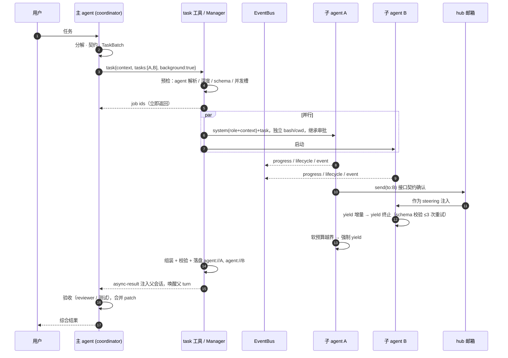
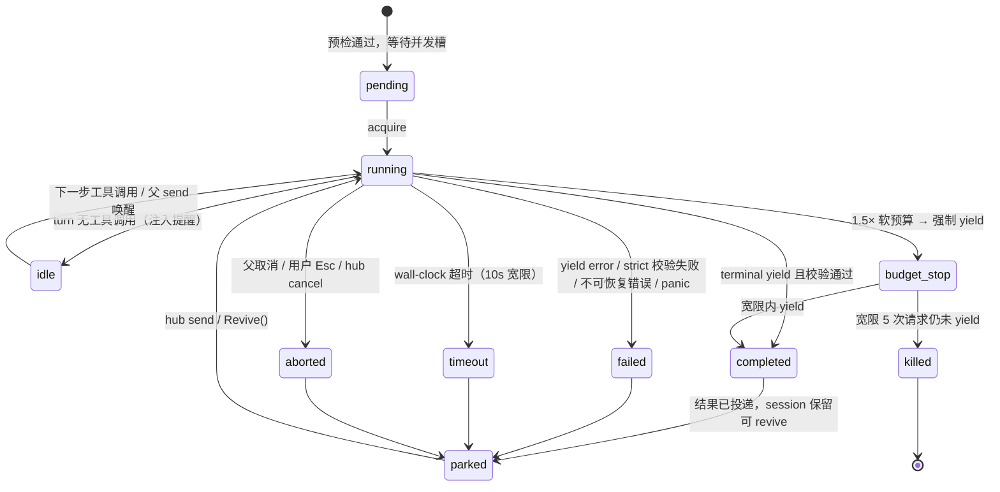

# codeclaw 演进方案

> 状态：**待评审** · 日期：2026-08-24 · 评审对象：`my_code_agent`（模块 `einoclaw-build`，agent 名 codeclaw，P0–P7 + P6-L1/L2 已完成）
> 参照：oh-my-pi（TS）· Claude Code · einoclaw（eino ADK）· claw-code（Rust 移植）
> 维度：Agent 架构 · 长上下文治理 · 结构化记忆 · 工具安全与运行治理 · 评测与审计闭环
> 所有诊断均附 `文件:行号`；本文是设计方案，不含代码改动，供评审后拆 spec/plan。

---

## 0. 结论先行：骨架是对的，每个子系统都差"最后一步"

my_code_agent 选对了三条承重不变量（事件驱动循环、JSONL 单一真相源、Tool/Runtime 分离 + 纯函数审批）和"Context = Index"的分层模型，这与 oh-my-pi、Claude Code 的设计 DNA 一致。问题在于：每一条不变量在代码里都只落实了"形"，没有守住"神"——压缩会切断 tool_call/tool_result 配对、yield 不会真正终止子 agent、超时的子 agent 被报成 completed、artifact 从未落盘、会话与记忆全部相对进程 cwd。这些不是功能缺失，而是让已有机制失效的缺口，因此本方案**先修缺口，再补能力**。

| 杠杆 | 改动 | 解决什么 | 落点 |
|---|---|---|---|
| 1 | **全局数据目录 + 项目作用域**：`~/.codeclaw/projects/<encoded-cwd>/` 放会话、产物、子 agent 转录；记忆按 scope/project 分库 | 不同项目的会话与记忆互相污染；必须在 agent 目录启动 | `cmd/agent`、`session`、`memory` |
| 2 | **Session v2**：entry 带 `id/parentId/ts`，header 带 `cwd/title/parent`，新增 `session_init`、`tool_execution_start`、`session_exit`；回放修复悬空 tool_call | 无法做树/分支/标题/恢复诊断；中断后留下孤儿 tool_call 导致下一次请求 400 | `session` |
| 3 | **压缩正确性**：切点绝不落在 tool 消息；token 估算覆盖工具块；摘要前先做 L6 剪枝；运行中 `msgs` 与 session 同步；溢出恢复通道 | 压缩后 API 报 insufficient tool messages；同一 run 内长工具循环无法压缩；截断内容永久丢失 | `context`、`agent`、`runtime.Sink` |
| 4 | **子 agent 运行时补全**：yield 终止 + schema 校验重试 + 状态机修正 + 独立 session/bash/cwd + 继承父权限 + 事件上抛 + 后台作业与 hub 通信 | 完成度不可靠、失败状态失真、子 agent yolo 绕过审批、父 turn 被阻塞、无法追问 | `subagent`、`agent`、`tui` |
| 5 | **记忆 v2**：scope/project/key/upsert、FTS 查询清洗、访问计数、项目知识层（文件笔记）、后台巩固 | 召回静默失败、重复记忆、跨项目串味、每个会话/子 agent 从零 explore（重复读取） | `memory`、`tool` |
| 6 | **治理与闭环**：审批规则引擎 + bash 分类器 + edit 工具 + hooks；trace 派生索引 + eval v2 + harness 行为回归套件 | 默认 yolo 无护栏、覆盖式写文件、无审计维度、评测不可并行且不测 harness 自身 | `permission`、`runtime`、`trace`、`eval` |

---

## 1. 现状诊断（附证据）

严重度：**crit** 直接导致错误结果或安全事故；**high** 让已有机制失效或体验明显落后；**med** 可后置。

### A · Agent 架构与子 agent

| # | 严重度 | 问题 | 证据 | 影响 |
|---|---|---|---|---|
| A1 | crit | `yield` 不终止子循环：工具只回写 "done"，Manager 仅在 `EventToolStart` 时抓取 data，循环继续到模型不再调工具 | `internal/subagent/yield.go:23-26`、`manager.go:72-89` | 子 agent 可能 yield 后继续改文件、多次 yield、白白消耗 MaxTurns；"显式终止"名存实亡 |
| A2 | crit | 超时/取消被报成 `completed`：ctx 超时后 `consumeStream` 与循环静默 break、不发 `EventError`；`StatusKilled` 从未赋值 | `manager.go:61-66, 83-98`、`internal/agent/loop.go:78-80, 111-113` | 父 agent 把半成品当成功结果综合；审计不可信 |
| A3 | high | outputSchema 只判 `data == nil`，无 JSON Schema 校验、无重试、无强制 tool choice（spec §2.4 承诺 ≤3 次重试） | `manager.go:92-97` | 结构化产出不可靠 |
| A4 | crit | 子 agent 固定 `ModeYolo` 且 `approver=nil`；worker 工具含 bash/write_file | `manager.go:57` | 父 agent 需审批的操作，委派出去就免审；审批边界被绕过 |
| A5 | high | 子 agent 无 transcript 持久化、无进度上抛 | `manager.go:72-89` | 无法观察、审计；失败时只剩最后一段文本 |
| A6 | high | `task` 同步阻塞父 turn；无后台作业、无追问、子 agent 之间无通信 | `task.go:83` | 长任务期间主 agent 不能响应用户；并行 slice 无法协调接口契约 |
| A7 | crit | 全局共享一个 `runtime.Bash`：互斥锁串行化所有 bash（含并行子 agent），且 `cwd` 是共享可变状态 | `cmd/agent/main.go:75`、`internal/runtime/bash.go:10-38` | 一个子 agent `cd` 会改变其他子 agent 和主 agent 的 cwd；bash 上的"并行"是假的 |
| A8 | med | 子 agent 定义硬编码、一句话 prompt；无 frontmatter 发现、无 tools/model/预算差异、不传 cwd 与项目约定 | `cmd/agent/main.go:102-106` | 无法定制；子 agent 缺少完成任务所需环境信息 |
| A9 | med | 派发参数只有 `subagent + prompt`，无 batch `context`、无验收标准契约、无 spawn policy/深度控制 | `task.go:44-57` | 一行 prompt 派发 → 子 agent 猜测目标 |

### B · 多会话管理

| # | 严重度 | 问题 | 证据 | 影响 |
|---|---|---|---|---|
| B1 | crit | `config.yaml`、`sessions/`、`memory.db` 全部相对进程 cwd；`sessions/current` 单一全局指针 | `cmd/agent/config.go:45`、`main.go:84, 138` | 必须在 agent 仓库目录启动 → 所有项目的会话、记忆混在一起；这正是"跨项目互相干扰"的根源 |
| B2 | high | Header 无 `cwd/timestamp/title/parent`；Entry 无 `id/parentId/timestamp`；Fork 全量复制 | `internal/session/entry.go:19-26`、`session.go:84-101` | 无法做会话树、分支摘要、标签、按项目列出、恢复诊断 |
| B3 | high | 恢复时不修复悬空 tool_call：Ctrl+C 取消后 `emit` 1s 超时丢事件 | `internal/agent/loop.go:34-40`、`session.go:58-81` | `/resume` 后首个请求被 API 拒绝 |
| B4 | med | 压缩摘要回放为 user 消息；`Entries()` 每次全量读文件 | `session.go:72-76`、`storage.go:47-65` | 模型把摘要当用户发言；大会话每轮 O(文件大小) |
| B5 | med | `/sessions` 只列时间戳 id | `session/manager.go:30-48` | 用户无法辨认会话 |

### C · 结构化记忆

| # | 严重度 | 问题 | 证据 | 影响 |
|---|---|---|---|---|
| C1 | crit | FTS5 `MATCH` 直接传用户原文；含 `? " ( ) - : *` 触发语法错误，`Recall` 的 err 被 `loop.go` 静默吞掉；trigram 要求 ≥3 字符 | `internal/memory/retrieval.go:28-34`、`loop.go:48` | 大量真实问句下召回为空而无人察觉 |
| C2 | high | 单库单表，无 `scope/project_id`；`/forget` 清全部 | `memory.go:45-56, 105-118` | 项目 A 的约定被召回到项目 B |
| C3 | high | 无去重/覆盖/失效；无 `updated_at/last_accessed/access_count/superseded_by` | `memory.go:65-102` | 重复项占满 topK；过时记忆无法被压制 |
| C4 | high | 每个 run 用最后一条用户文本重新召回并作为第二条 system 消息插入 | `loop.go:45-52` | 提示词前缀每轮变化，prompt cache 持续失效；查询质量低 |
| C5 | high | 没有"项目知识"层；没有从 session 自动提炼记忆的后台管线 | `internal/memory` 整体 | 每个新会话、每个子 agent 都从零 explore——"重复读取"的主要来源 |

### D · 长上下文治理

| # | 严重度 | 问题 | 证据 | 影响 |
|---|---|---|---|---|
| D1 | crit | `findCutPoint` 不检查 tool_call/tool_result 配对 | `internal/context/compaction.go:11-20` | 保留段以孤儿 tool 消息开头 → API 400；spec "绝不切在 toolResult" 未实现 |
| D2 | high | `estimateTokens` 只数 text 块 | `tokenizer.go:7-15` | keepRecentTokens 实际保留远超预算 |
| D3 | high | `serializeConversation` 只序列化 text | `compaction.go:23-43` | 摘要的"文件/产物""失败/发现"没有信息源 |
| D4 | crit | 压缩只在 `AfterTurn` 作用于 session 文件；循环内 `msgs` 是局部变量；溢出错误只 `EventError + break` | `context/manager.go:77-82`、`loop.go:53-91`、`tui.go:343-344` | 同一 run 内 20 次工具调用撑爆上下文时无任何恢复 |
| D5 | high | Sink 从未 `SetArtifactDir`；没有读回 artifact 的工具；没有旧工具结果剪枝 | `tool/executor.go:63`、`runtime/sink.go:97-107` | L6 只实现一半：截断内容永久丢失 |
| D6 | high | 没有 L1 项目层：不加载 CLAUDE.md/AGENTS.md、不注入 cwd/日期/git | `cmd/agent/main.go:21, 134` | 模型不知道自己在哪个项目 |
| D7 | med | 压缩后没有 auto-continue、不恢复最近文件、todo 不保留 | `context/manager.go:84-98` | 压缩后第一步常常是重读文件 |

### E · 工具安全与运行治理

| # | 严重度 | 问题 | 证据 | 影响 |
|---|---|---|---|---|
| E1 | high | 默认 `approval_mode: yolo`；审批只有 tier×mode，无 allow/deny/ask 模式规则，无"记住允许" | `config.go:64-66`、`permission/policy.go:31-47` | 要么全问要么全放；P4 验收"`rm -rf /` 被拒"默认不成立 |
| E2 | crit | bash 无危险命令分类、无超时；只杀直接子进程不杀进程组；env 全量继承（含 API key） | `runtime/bash.go:23-38`、`sandbox.go:10-33` | 管道/后台进程残留；密钥泄漏 |
| E3 | crit | 只有整文件覆盖的 `write_file`，没有 `edit`；无 read-before-write/mtime 检查；`read_file` 字节偏移切断 UTF-8；路径不限工作区 | `tool/tools.go:41-93` | 模型凭记忆整文件重写 → 静默丢代码 |
| E4 | high | MCP 工具一律 `TierRead`，丢弃 `required`；无调用超时 | `tool/mcp.go:34, 84-98` | 外部未知工具自动放行；慢 server 卡死 turn |
| E5 | med | 没有 hooks | — | 用户无法注入组织级护栏 |

### F · 评测与审计闭环

| # | 严重度 | 问题 | 证据 | 影响 |
|---|---|---|---|---|
| F1 | high | trace 只聚合 4 个数；无耗时/成本/缓存/按工具统计；子 agent 不产生 trace | `trace/tracer.go:9-40` | 无法回答"钱花在哪、哪个子 agent 拖慢" |
| F2 | high | eval 用 `os.Chdir`（进程全局）；不记录 session；无 verify 命令；无 pass@k；不测 harness 自身 | `eval/evaluator.go:46-50, 66-78` | 评测不能并行；测不了压缩/审批/委派是否正确 |

---

## 2. 参考设计对照

| 维度 | my_code_agent | oh-my-pi | Claude Code | einoclaw / eino ADK |
|---|---|---|---|---|
| 子 agent 声明 | main.go 硬编码 3 个 | markdown frontmatter：name/description/tools/spawns/model/output/blocking/readSummarize；bundled/user/project，first-wins | `.claude/agents/*.md` + 插件 + 内置；frontmatter name/description/tools/model | 代码注册 `SubAgents`，工具描述枚举 |
| 派发形式 | `tasks[]` 同步 | `{context, tasks[]}`，每项 name/agent/task/effort/outputSchema/schemaMode/isolated；同步或异步 job；BLOCKING 内联 | Agent 单项 + `run_in_background`；并行 = 多个 tool_use；Workflow 脚本 pipeline/parallel | agent 单项 + `run_in_background`；前台+超时自动转后台 |
| 并发控制 | Semaphore 固定 4 | 可 resize Semaphore + 带 AbortSignal 的 acquire | 每 workflow min(16, CPU−2) | 无 |
| 子 agent 上下文 | 仅 `[prompt]` | Role + 批量 Context + 计划 + Coop/Peers/Completion；blank history | 系统提示 + CLAUDE.md + cwd | prompt |
| 完成协议 | yield 不终止；`data!=nil` | yield terminal/incremental/error；参数 schema 由 outputSchema 派生；工具内校验重试 ≤3 后 override；空结果 ≤3 后 abort；`shouldTerminate`；idle 提醒；软预算 → 1.5× 强制 yield → 宽限 5 次后硬杀 | 最终文本即报告；Workflow 内 StructuredOutput + schema；SubagentStop hook | 最后文本 |
| 通信 | 无 | `hub`：list/send/wait/inbox/jobs/cancel；send 即 steering；完成自动投递；parked 可 revive；`agent://` `history://` | 后台完成 → 通知注入；`SendMessage` 续聊；TaskStop/Monitor | `task_output` 轮询 + 订阅 |
| 失败控制 | timeout + MaxTurns；状态不准 | abort + 10s 宽限；wall-clock；retry 链 + 模型回退；子 agent 内溢出自压缩；partial 保留；"completed ≠ 验收" | 重试、溢出压缩、超时；失败返回 null 由脚本过滤 | 取消 |
| 写隔离 | 共享 cwd/bash | worktree：patch/branch/apply；并发编辑自动解决 | `isolation: worktree` | 无 |
| 可观测 | 无 | Agent Hub；EventBus 三通道；sidecar JSONL | 进度行 + 转录 + 完成通知 | 生命周期事件 |
| 会话存储 | `./sessions/<id>.jsonl` 线性 | `~/.omp/agent/sessions/<encoded-cwd>/<ts>_<id>.jsonl`；id/parentId 树 + leaf；header 含 cwd/title/parent；lazy；title slot；blob 外置 | `~/.claude/projects/<encoded-cwd>/<uuid>.jsonl`；uuid/parentUuid/cwd/gitBranch | eino FileStore `.evlog` |
| 压缩 | AfterTurn 六字段 | 六种触发；剪枝（保护 40k、最少省 20k、superseded/useless）；shake；split-turn；`<files>`；预压缩；context promotion | 阈值压缩；先清旧工具结果；结构化摘要；压缩后恢复文件；PreCompact hook | reduction：截断 + 调模型前清理全部工具结果；摘要中间件 |
| 记忆 | 全局 SQLite FTS，问句直传 | backend 可插；global/per-project/per-project-tagged；autoRecall 首轮 + autoRetain；两阶段后台巩固；learn 去重脱敏限量；`memory://` | CLAUDE.md 层级；项目记忆目录：`MEMORY.md` 索引 + 一文件一记忆 | 短期记忆中间件 |
| 审批 | tier × mode | tier(args) + tool policy + user policy；bash 危险模式强制 prompt；未知工具默认 exec，MCP 默认 write | allow/deny/ask 规则 `Bash(git *)`；模式；hooks 裁决；沙箱 | eino HITL |
| hooks | 无 | tool_call/tool_result/context/session_*/compaction/retry | PreToolUse/PostToolUse/Stop/SubagentStop/PreCompact/SessionStart/UserPromptSubmit | 中间件链 |
| 评测审计 | 字节 diff；4 个计数 | session 即 trace + 用量；eval 工具 | 转录 + `/cost` + OTel + `-p --output-format json` + plugin eval | claw-code：mock 服务 + 脚本化场景 parity harness |

---

## A. Agent 架构：派发 · 并行 · 通信 · 完成度 · 失败

结论：主 agent 派发的正确抽象不是"并行调用几个函数"，而是**一组有契约的、各自拥有独立 session 与运行时的子进程式执行单元**，通过三种通道（结果投递、事件总线、消息邮箱）与父协作，由状态机和预算系统约束寿命。

### A.1 派发流程（十步）

1. **主 agent 自己做分解。** 顶层计划、slice 划分、跨 slice 接口契约是主 agent 的职责，禁止外包给空白上下文的子 agent（oh-my-pi `eager-task.md`："NEVER delegate overall plan"）。
2. **构造 TaskBatch。** `{context, tasks[]}`：`context` = Goal / Constraints / Contract；每个 task = Target（文件与符号、非目标）/ Change（步骤）/ Acceptance（可观察结果）。一行 prompt 直接拒绝。
3. **Manager 预检。** 解析 agent 定义（项目 > 用户 > 内置）、spawn policy 与递归深度、模型与 outputSchema 优先级（task 项 > agent 定义 > 父会话）、申请并发槽。预检失败立刻返回，不起子进程。
4. **为每个 task 建 Run。** 独立 session sidecar（`agent-<Name>.jsonl`，首条 `session_init`）、独立 `runtime.Bash`（独立 cwd）、工具集 = agent.tools ∪ {yield} − {task 若已到深度上限}、权限 = 父 mode + 用户规则（不是 yolo）。
5. **worker pool 并行。** 可 resize 的 Semaphore；acquire 带 ctx 取消；结果按输入序回填；失败不互相拖累（allSettled），父取消时停止调度新 task。
6. **事件上抛。** 总线三通道 `lifecycle` / `progress` / `event`；TUI 订阅渲染最小 Agent Hub；父的 tool 结果带进度摘要。
7. **以 yield 终止。** terminal yield 退出循环；incremental 累积分段；`result.error` 主动放弃并说明阻塞。无工具调用的 turn 视为 idle，注入提醒（≤3 次）；超软预算注入收尾通知，1.5× 强制 yield，宽限 5 次后硬杀。
8. **结果组装与校验。** 合并 terminal/incremental；outputSchema 校验（permissive 接受带 warning；strict 判 failed）；完整产出落盘 `agent://<name>`，父只拿摘要 + 指针（限 500KB/5000 行）。
9. **投递给父。** 同步：作为 `task` 工具结果；后台：立即返回 job id，完成后以 `custom_message`（async-result）注入父会话并唤醒父 turn；投递只发生一次。
10. **父验收与合并。** "completed 只表示成功 yield，不表示产物可接受"：父必须自己跑验证或派 reviewer；worktree 模式按 patch/branch 合并，冲突保留产物并报告。



### A.2 派发契约：TaskBatch 与 agent 定义

oh-my-pi 的 `prompts/tools/task.md` 把"任务描述质量"变成硬约束；claw-code 的 `TaskPacket`（objective / scope / resources / acceptance_criteria / permission_profile / verification_plan）是同一思想的数据结构化版本。合并为：

```go
// internal/subagent/spec.go
type AgentDef struct {
    Name, Description, SystemPrompt string
    WhenToUse    string
    Tools        []string       // 限定工具；空 = worker 默认集
    Spawns       []string       // 可再派发的 agent；空 = 不可派发（替代 Without("task")）
    Model        string         // 角色别名 "@fast" 或具体 model id
    OutputSchema map[string]any // JSON Schema；yield 参数由它派生
    MaxTurns     int            // 硬上限（默认 50）
    SoftBudget   int            // 软请求预算（scout 100 / worker 200）
    Timeout      time.Duration
    ReadOnly     bool           // 只读 agent：工具集裁成 read/glob/grep
    Blocking     bool           // 后台模式下仍内联等待
    Source       string         // bundled | user | project
    FilePath     string
}

type TaskItem struct {
    Name         string         // 稳定 CamelCase id；用于 hub 寻址与 agent://
    Agent        string         // 缺省 = spawn policy 的默认 worker
    Task         string         // Target / Change / Acceptance 三段
    OutputSchema map[string]any
    SchemaMode   string         // permissive | strict
    Isolated     bool           // worktree 隔离
    Effort       string         // lo | med | hi
}

type TaskBatch struct {
    Context    string     // Goal / Constraints / Contract，整批共享
    Tasks      []TaskItem
    Background bool       // false = 同步返回；true = 返回 job ids，完成后投递
}
```

agent 定义改为 markdown frontmatter 发现：`.codeclaw/agents/*.md`（项目）→ `~/.codeclaw/agents/*.md`（用户）→ 内置（explorer / reviewer / planner / worker），同名 first-wins；坏文件只告警跳过。`task` 工具 Description 动态枚举，每个 agent 一段（名字 + READ-ONLY/BLOCKING 标记 + 描述 + 使用边界）。

### A.3 运行时：独立 session、独立 bash、继承权限

- **独立 session sidecar**：`<projects>/<cwd>/<ts>_<sid>/agent-<Name>.jsonl`，首条 `session_init` 记录 systemPrompt / task / tools / outputSchema / parentToolCallID / depth。可审计、可 `history://<id>` 读转录、resume 时被 Hub 发现为 parked 并 revive。
- **独立 Bash 与 cwd**：`runtime.NewBash(cwd)` 按 Run 创建；`cd` 只影响自己；Exclusive 语义保留在 Run 内部；worktree 模式下 cwd 指向 worktree。
- **权限继承而非 yolo**：子 agent Executor 用父 mode + 用户规则；`Prompt` 决策在 headless 下默认拒绝并说明（oh-my-pi），可选升级到父审批队列；用户 deny 规则任何模式都生效。
- **工具集与深度**：= agent.Tools ∪ {yield} ∪ {hub}；达到 `maxRecursionDepth`（默认 2）时移除 `task` 并清空 spawns；agent 不能派发同名 agent。

### A.4 完成度保证：五层

| 层 | 机制 | 参照 | 落点 |
|---|---|---|---|
| 契约 | task 必须含 Acceptance；batch 必须含 Contract；schema 校验拒绝一行 prompt | oh-my-pi task.md | `task.go` 参数 schema + 预检 |
| 协议 | yield 三态；yield 参数 schema 由 outputSchema 派生；工具内校验失败 ≤3 次重试后 override；空结果 ≤3 次后 abort；terminal yield 终止循环 | oh-my-pi `tools/yield.ts`（MAX_SCHEMA_RETRIES=3, MAX_EMPTY_RESULT_RETRIES=3, `shouldTerminate`） | `yield.go` 重写；`agent.loop` 增加"终止型工具"判定 |
| 驱动 | 无工具调用的 turn = idle → 提醒 ≤3 次；软预算越界注入收尾通知；1.5× 强制只剩 yield（tool choice 强制）；宽限 5 次后硬杀 | oh-my-pi `executor.ts` SOFT_REQUEST_BUDGET / BUDGET_STOP_GRACE_REQUESTS | Manager 的 run 监视器 + steering 通道 |
| 验证 | "completed ≠ 验收"写进父提示词；reviewer 有自己的 outputSchema；非平凡改动派 reviewer 或跑验证命令 | oh-my-pi task.md；Claude Code code-review | coordinator 提示词 + 内置 reviewer |
| 可恢复 | 失败/超时/预算耗尽都保留 transcript、最后文本、incremental sections、`agent://` 部分产物；父可 `hub send` 唤醒 parked 子 agent 追问 | Agent Hub revive；Claude Code SendMessage | `Run` 状态 parked + `Revive()` |

### A.5 通信：三条通道

- **结果通道（子→父，一次性）**：yield 产出 → 校验 → 落盘 → tool 结果或 async-result。只传结构化摘要与指针，大内容走 `agent://` / `artifact://` / `local://`。
- **事件通道（子→UI/父，流式）**：EventBus 三 channel；父 agent 不消费原始事件（避免污染上下文），只有 TUI 与 Manager 消费。
- **邮箱通道（父↔子、子↔子，异步）**：`hub {op: list|send|wait|inbox|jobs|cancel}`。send 不阻塞、有送达回执；对 idle/parked 目标 send 即唤醒；父→子的 send 作为 steering 注入；`wait` 只在完全阻塞时用，返回"第一个到达的事件"；`inbox` 非阻塞清空。只做协调，不传长内容。

```go
// internal/bus/bus.go
type Bus struct{ mu sync.RWMutex; subs map[string][]chan Envelope }
type Envelope struct{ Channel string; Payload any; At time.Time }
func (b *Bus) Publish(ch string, p any)
func (b *Bus) Subscribe(ch string, buf int) (<-chan Envelope, func())

const (
    ChSubagentLifecycle = "subagent.lifecycle" // {id, agent, status, sessionFile, parentToolCallID}
    ChSubagentProgress  = "subagent.progress"  // {id, currentTool, requests, tokens, contextTokens, retryState}
    ChSubagentEvent     = "subagent.event"     // {id, agent.AgentEvent}
    ChJobSettled        = "job.settled"        // {jobID, result}
)

// internal/subagent/hub.go
type hubArgs struct {
    Op      string   `json:"op"`      // list | send | wait | inbox | jobs | cancel
    To      string   `json:"to"`      // 子 agent Name 或 "all"
    Text    string   `json:"text"`
    ReplyTo string   `json:"replyTo"`
    IDs     []string `json:"ids"`
    Timeout int      `json:"timeout"`
}
```

### A.6 失败控制：状态机与处置表



| 失败类型 | 处置 | 父看到什么 |
|---|---|---|
| 模型瞬时错误（429/5xx/网络） | 与溢出互斥的重试通道：`min(500ms·2^(n−1), 8s)` × 75–100% 抖动，尊重 retry-after；≤10 次；模型回退链 | progress 的 `retryState`；最终 `retryFailure` |
| 子 agent 上下文溢出 | 子 agent 自己走 D 节压缩阶梯后 continue；不重试溢出请求 | 仅 trace 可见 |
| wall-clock 超时 | cancel → 10s 宽限（有副作用工具不硬杀）→ `timeout`，保留 partial | `[timeout]` + 最后文本 + sections + `history://` |
| MaxTurns / 软预算 | 先通知收尾，1.5× 强制只剩 yield，宽限后硬杀 | `completed(forced)` 或 `killed` |
| schema 不符 | 工具内反馈 issue 重试 ≤3；permissive 接受 + warning；strict 判 failed | `structuredOutput.status` + error |
| 工具被权限拒绝 | 子 agent 收到 denied 继续；核心步骤被拒应 yield error | 阻塞描述；可放行后 revive |
| 父取消 / 用户中断 | abort 传播；未启动跳过；进行中等宽限；标 aborted 但 transcript 保留 | 逐项 aborted |
| goroutine panic | Run 入口 recover → failed + 堆栈进 trace | failed + error |
| worktree 合并冲突 | 不自动解决；保留 patch/branch，报告冲突文件 | patchPath/branchName + 冲突清单 |

### A.7 委派策略补三点

- `always` 模式下主 agent 保留**只读**工具（read/glob/grep）用于验收，写与 exec 仍只给 worker。
- 把 oh-my-pi 的四条"独自工作例外"原文化进提示词：单文件 30 行内 / 无需改代码的直接回答 / 用户明确要求执行的命令 / **只有一个可运行 slice 时不要派单个子 agent（lossy handoff，不是并行）**。
- 每个 task 写明"跳过 formatter/lint/全量测试，统一最后做一次"——并行编辑下中途验证互相阻塞。

### A.8 与 Claude Code 的分工思路

Claude Code 把"确定性编排"与"模型自由委派"分成 Agent（单个、可后台、SendMessage 续聊）与 Workflow（pipeline/parallel、schema 输出、预算）。codeclaw 现阶段不做 Workflow，但保留两个能力点：**后台 + 续聊**（hub/revive）与 **结构化输出 + 失败过滤**（yield + schema）。M2 稳定后如需多阶段编排，以 YAML 的 WorkflowSpec 实现而非嵌入脚本。

---

## B. 多会话管理与项目隔离

Claude Code 与 oh-my-pi 做法一致：**数据目录在家目录下，按规范化 cwd 分桶**，配置分层（用户 → 项目 → 本地覆盖），记忆按项目作用域。claw-code `Session.workspace_root` 注释记录了不这么做的后果："parallel lanes race and report success while writes land in the wrong CWD"。

### B.1 目录布局

```
~/.codeclaw/
├── config.yaml                      # 用户级：models / approval / delegation / memory / hooks
├── agents/*.md                      # 用户级子 agent 定义
├── memory/
│   ├── global.db                    # scope=global 的事实记忆
│   └── MEMORY.md                    # 人可读索引（Claude Code 风格）
├── blobs/<sha256>                   # 内容寻址的大块
└── projects/
    └── -Users-cyanyumu-Projects-GoProject-foo/     # encoded(canonical cwd)
        ├── project.json             # cwd、git root、时间、标题
        ├── memory.db                # scope=project 的事实记忆 + file_notes
        ├── current                  # 本项目的当前会话指针
        ├── 20260824-101500_8f2c1d.jsonl            # 主会话（title slot + header + entries）
        └── 20260824-101500_8f2c1d/                 # 该会话的产物目录
            ├── 0.bash.log           # artifact://0
            ├── Reviewer.md          # agent://Reviewer
            ├── agent-Reviewer.jsonl # history://Reviewer
            └── handoff-*.md

<project>/.codeclaw/
├── config.yaml                      # 项目级覆盖
├── agents/*.md
├── hooks/
└── AGENTS.md / RULES.md             # 也识别根目录 CLAUDE.md / AGENTS.md
```

encoded-cwd：先 `filepath.EvalSymlinks` 规范化，家目录下 `-<relative>`，其余 `--<abs>--`，分隔符换 `-`。项目身份（记忆 scoping）= git 主工作区根 basename + 绝对路径稳定哈希，同一仓库的多个 worktree 共享项目记忆。

### B.2 Session 格式 v2

```go
type Entry struct {
    Type      EntryType `json:"type"`
    ID        string    `json:"id"`
    ParentID  string    `json:"parentId,omitempty"` // 树：append 时 = 当前 leaf
    Timestamp string    `json:"ts"`
    // header
    Version int; SessionID, CWD, GitBranch, Title, TitleSource, ParentSession, Model string
    // message
    Message *message.Message; Usage model.Usage
    // compaction: Summary, FirstKeptEntryID, TokensBefore, Files{Read, Modified}
    Compaction *Compaction
    // session_init（子 agent 首条）: SystemPrompt, Task, Tools, OutputSchema, Agent, Depth, ParentToolCallID
    Init *SessionInit
    // custom: tool_execution_start / session_exit / todo / mode_change
    CustomType string; Data json.RawMessage
    // label / title_change / model_change
    TargetID, Label string
}
```

- **leaf 指针 + 树**：Append 以 leaf 为 parentId；Branch 只移 leaf；Fork = 新文件 + `parentSession` + 复制产物目录；Replay 沿 parentId 回溯（遇重复 id 终止）。
- **FirstKeptEntryID** 替代重追加保留消息（现在保留段出现两次，`session.go:103-117`）；摘要回放为独立角色 `compactionSummary`，到模型边界渲染为带前言的 user 消息。
- **tool_execution_start / session_exit**：恢复时若最后一条 assistant 有无配对的 tool_calls，从模型上下文剔除该 assistant 消息并合成 `stopReason: aborted` 标记（与 oh-my-pi 一致）。
- **lazy 创建 + title slot**：第一条 assistant 消息前不落盘；文件头 256 字节定宽 title 槽，列会话只读前 4KB。
- **大块外置**：>500k 字符截断标记；图片/超长结果存 `blobs/<sha256>`。

### B.3 发现、恢复与并发安全

- **列会话**：按项目目录扫描前缀（title/首句/时间/分支），mtime 排序缓存 stat；`--continue` 取本项目最近；`--resume <id前缀>` 本项目优先、全局兜底。
- **自动标题**：首个 assistant 回复后小模型生成 ≤12 字标题（`titleSource=auto`），用户 `/title` 覆盖后不再自动改。
- **多实例**：同项目允许多个进程，但一个会话文件只能被一个进程独占（`flock`）；产物 id 先扫描最大值再递增。
- **写入保证**：追加后 Flush；全量重写用临时文件 + rename；持久化错误锁存。
- **子 agent 归属**：sidecar 与产物放父会话产物目录；Hub 打开已恢复会话时扫描为 parked 行。
- **/clear 与 /new**：`/clear` 写 `reset_boundary`；`/new` 新建文件并更新本项目 `current`。

---

## C. 结构化记忆

共识：**记忆是背景上下文，让位于活状态**；**指令记忆与事实记忆是两套东西**；**记忆与压缩分离**。升级为三层：

- **L1 指令记忆（文件）**：`~/.codeclaw/AGENTS.md` → git root 到 cwd 逐级 `AGENTS.md`/`CLAUDE.md`（祖先先、近者后）→ 更深目录只列路径（`<dir-context>`），读到该目录文件时懒加载。支持 `@path` 导入（≤5 跳、防环）。`RULES.md` 作为粘性规则，每次压缩后重新贴到最近 turn 附近。
- **L7 事实记忆（SQLite，分 scope）**：`scope = global | project`，默认 per-project-tagged（写项目库，召回项目库 + 全局库并去重）。
- **L7′ 项目知识（file_notes）**：每个文件/目录一条结构化笔记（摘要、导出符号、职责、mtime/sha），由 explorer 子 agent 产出、read 结果后台提炼、压缩 `<files>` 沉淀。新会话启动注入"项目地图"（≤1.5k token），`read` 遇到 mtime 未变的已知文件先返回笔记 + 行号索引。
- **不做**：代码符号级事实不进事实记忆；不用 LLM judge 决定召回；向量检索后置。

### C.1 Schema v2

```sql
CREATE TABLE memories (
  id INTEGER PRIMARY KEY,
  scope TEXT NOT NULL,              -- global | project
  project_id TEXT,
  kind TEXT NOT NULL,               -- user | feedback | project | reference | decision
  key TEXT,                         -- 稳定键，用于 upsert
  content TEXT NOT NULL,
  why TEXT,
  source TEXT NOT NULL,             -- user | model | harness
  veracity REAL NOT NULL DEFAULT 1.0,
  importance REAL NOT NULL DEFAULT 0.5,
  created_at INTEGER NOT NULL, updated_at INTEGER NOT NULL,
  last_accessed INTEGER, access_count INTEGER NOT NULL DEFAULT 0,
  superseded_by INTEGER REFERENCES memories(id),
  tags TEXT
);
CREATE UNIQUE INDEX memories_key ON memories(scope, project_id, key) WHERE key IS NOT NULL;
CREATE VIRTUAL TABLE memories_fts USING fts5(content, tags, tokenize='trigram');

CREATE TABLE file_notes (
  project_id TEXT NOT NULL, path TEXT NOT NULL,
  summary TEXT NOT NULL, symbols TEXT,
  mtime INTEGER NOT NULL, size INTEGER NOT NULL, sha TEXT NOT NULL,
  updated_at INTEGER NOT NULL, hit_count INTEGER NOT NULL DEFAULT 0,
  PRIMARY KEY (project_id, path)
);
```

### C.2 写入：去重、覆盖、脱敏、限量

- `remember(content, kind, key?, why?)`：有 key → upsert（旧内容进 history 表）；无 key → 近重复检测（trigram 相似度 ≥0.85 或 FTS 命中 + 编辑距离），命中则更新而非新增。
- 写入前密钥脱敏；单条 ≤2000 字符；每项目上限按 importance × recency 淘汰。
- `forget(id|key)` 与 `invalidate`（veracity=0 + superseded_by）替代清全库；`/memory clear` 仅清当前项目。
- 子 agent 共享父 recall 但**不自动 retain**；explorer 产出走 file_notes。

### C.3 召回：查询构造、FTS 清洗、打分、注入位置

```go
func buildRecallQuery(history []message.Message, task string) string // 最近 3 个用户 turn + 当前任务，截 4000 字

func ftsQuery(q string) string {
    terms := tokenize(q)                 // 按空白/标点切；中文 2–4 字滑窗；丢弃 < 3 rune（trigram 限制）
    for i, t := range terms { terms[i] = `"` + strings.ReplaceAll(t, `"`, `""`) + `"` }
    return strings.Join(terms, " OR ")   // 永不把原文直接交给 MATCH
}
// score = (0.45*fts + 0.2*importance + 0.15*recency + 0.1*log1p(access) + 0.1*scopeBoost) * veracity
```

- **注入位置与频率**：召回块放 system prompt 末尾固定位置，**只在会话首轮与每次压缩后刷新**——保证 prompt cache 前缀稳定。显式 `recall` 工具结果进 transcript。
- **注入预算**：≤5000 token；每条带 `[kind · scope · 置信]` 与 id，可 `read memory://<id>`。
- **访问回写**：注入即 `access_count++`、`last_accessed=now`。
- **压缩时作为额外上下文**：摘要器输入附 `<memory-context>`。

### C.4 减少重复读取的三个闭环

1. **会话内**：read 记录 `path → {mtime, sha, 已读区间}`；未变更再读返回"未变更，上次在 turn N，行 a–b"；旧 read 结果在 L6 剪枝里标 superseded（oh-my-pi `compaction.supersedeReads`）。
2. **压缩后**：compaction 记录 `Files{Read, Modified}`，摘要带 `<files>` 树；压缩后自动重新注入最近 3 个文件的相关区间（Claude Code 行为）。
3. **跨会话**：file_notes 项目地图注入 + read 先给笔记；explorer 的 outputSchema 固定为 `{files:[{path, role, symbols}], entrypoints, notes}`，Manager 自动 upsert；后台巩固从 session JSONL 提取"读过且有结论的文件"。

### C.5 后台巩固管线

两阶段（oh-my-pi local backend）：**阶段一**对每个"变更过且空闲 ≥12h、≤30 天"的会话提取决策/约束/失败/工作流（每会话 ≤4k token，并发 8，lease 120s）；**阶段二**小模型巩固成 `MEMORY.md`（一行一指针）+ 注入用 `memory_summary`（≤5k token）。SQLite 作业表 + lease/heartbeat 防重复；子 agent 会话不参与。触发：启动、`/memory rebuild`、空闲 5 分钟。

---

## D. 长上下文治理

现状：一种触发、一种手段、零恢复。目标结构：**先便宜后昂贵**（剪枝 → 外置 → 摘要）；**触发点覆盖 turn 内**；**溢出与重试互斥**。

### D.1 记账与预算

- provider usage 为真值；本地估算覆盖 text / thinking / tool_call args / tool_result；区分 cache read/write。
- `threshold = window − max(0.15·window, 16384)`；新增**预阈值带** `[threshold − lead, threshold)`，`lead = clamp(0.125·threshold, 8k, 32k)`，进入即后台用分支快照算摘要，越界秒级提交。
- 状态栏显示 `ctx 63% · $0.42`。

### D.2 六种触发与循环内同步

| 触发 | 时机 | 方法序列 | 之后 |
|---|---|---|---|
| manual | `/compact [指令]` | 摘要 | 无 auto-continue |
| threshold | assistant 成功消息后超阈值 | 剪枝 → 外置 → 摘要 | 注入 auto-continue |
| mid-turn | 工具循环中、下一次模型调用前的安全边界 | 同上，同步 | 循环自己继续 |
| overflow | 模型返回溢出错误 | context promotion → 剪枝 → 外置 → 摘要 | 移除失败消息后 continue |
| incomplete | `finish_reason=length` | 同 overflow，允许 handoff | 移除不完整消息后 continue |
| idle | 空闲 ≥300s 且超 idle 阈值（默认关） | 剪枝 → 摘要 | 无 |

实现要点：`agent.loop` 不再持有私有 `msgs` 切片作为真相；每步输入从 `ContextManager.Build(session)` 重建（带缓存）；循环增加 `BeforeStep(ctx)`（steering、mid-turn 压缩、hooks context）与 `AfterStep(usage, err)`（记账、overflow/retry 分流）。

### D.3 三级阶梯

1. **L6 剪枝（零模型调用）**：保护最近 40k token 工具结果；至少省 20k 才执行；单条 <50 token 不剪；superseded read 与 useless 绕过保护窗；替换为 `[Output truncated – N tokens · artifact://id]`；skill/计划文件/RULES 永不剪。只替换内容不删消息，配对永不拆。缓存友好：仅在后缀 ≤8k 或已过 cache 存活期时做。
2. **外置（shake）**：更早的大块 tool 结果与代码块写入 artifact 留指针；回收不足则跳下一级。
3. **摘要**：六字段保留，输入改为**完整序列化**（含工具调用与截断后结果）；切点：从新到旧累计到 keepRecentTokens（20k）后继续向旧移动直到落在 user 消息或无 tool_calls 的 assistant；切点前 metadata 并入保留段；切点不在用户 turn 起点则 split-turn 双摘要。摘要附 `<files>` 树（Read/Write/RW，≤20）；迭代压缩用 update-summary 提示词并带前一次摘要。

### D.4 压缩后与缓存友好

- 压缩后注入开发者消息"上下文已压缩，继续当前任务；以下是最近文件的当前内容"，重新 read 最近 3 个文件区间；恢复 todo。
- 提示词排布固定：`[system 基础] [L1 项目文件] [工具定义（按名排序）] [记忆块] [摘要] [保留段] [动态提醒]`；动态内容放最后一条用户消息附近。
- L1 层：cwd、git 根与分支、日期、平台、项目约定文件。

### D.5 artifact 与读回

Executor 为每个 Sink 设置会话产物目录，截断返回 `artifact://N`；内部 URL 路由让 `read` 可读 `artifact://N:100-200`、`agent://Name`、`history://Name`、`memory://id`（>8MB 拒绝整读）。

---

## E. 工具安全与运行治理

### E.1 审批三输入与决策顺序

```yaml
permissions:
  mode: write                     # always-ask | write | yolo（默认 write）
  allow: ["bash(git status*)", "bash(go test*)", "bash(go build*)", "read(**)", "mcp__github_*"]
  ask:   ["bash(git push*)", "write(go.mod)"]
  deny:  ["read(./.env*)", "bash(rm -rf *)", "bash(curl * | sh*)"]
```

```go
type ToolDecision struct { Tier Tier; Policy string /* allow|deny|prompt */; Override bool; Reason string }
func Resolve(td ToolDecision, rules Rules, mode Mode, call message.ToolCall) (Decision, string) {
    // 1. 工具 deny 永远 deny；2. 用户 deny 永远 deny；
    // 3. yolo：工具显式 allow/prompt → 用户 allow/ask → allow（裸 override 在 yolo 下忽略）；
    // 4. 非 yolo：Override 时除非工具 allow 否则 prompt；
    // 5. 工具显式 policy → 用户规则 → tier×mode。
}
```

- 工具接口增加 `Approval(args) ToolDecision`（替代固定 `Tier()`）；未声明的自定义工具与 MCP 默认 `exec`/`write`（修复 E4）。
- 弹窗提供"允许一次 / 本会话允许 / 加入项目规则"，后两者写入会话内存与 `.codeclaw/config.yaml`。
- 提示显示工具专属细节（命令、路径、子 agent 名与任务、MCP 来源与 reason）。

### E.2 bash

- **分类器**（Claude Code bash 的 readOnlyValidation / destructiveCommandWarning / pathValidation / commandSemantics 子模块）：按 shell 词法切分管道与 `&&`，逐段判定：只读白名单 → read；`rm -rf`、fork bomb、`curl|sh`、写 `/etc`、`sudo`、关机 → Override 强制 prompt；路径逃逸工作区的写 → prompt。
- **超时**：默认 120s（可到 600s）→ SIGTERM 进程组 → 5s 后 SIGKILL；`Setpgid` + 按 pgid 杀。
- **后台进程**：走 `hub start/ps/logs/stop`（项目级命名进程，readiness 用 log 正则或端口）。
- **环境**：env 白名单 + 模式脱敏（`*_API_KEY`、`*TOKEN*` 默认不传）。
- **输出**：Sink 每行列宽上限 + ANSI 清洗；50KB 溢出即镜像到 artifact。

### E.3 文件工具

- 新增 `edit(path, old, new, replace_all)`：old 唯一匹配；**必须先 read 过**；mtime 变化拒绝并要求重读；保持换行与 BOM。
- `read` 按行 offset/limit（UTF-8 安全）、带行号、默认 300 行、>2MB 或二进制给提示；目录读返回深度 2 的树。
- 路径边界：`cwd + additionalDirectories` 之外的写 → prompt；符号链接解析后再判。
- `glob` 支持 `**`，按 mtime 排序限量。

### E.4 hooks

```yaml
hooks:
  PreToolUse:
    - matcher: "bash"
      command: ".codeclaw/hooks/guard.sh"   # stdin JSON {session, tool, args, cwd}
                                            # exit 0 放行；exit 2 阻止（stderr 为原因）
                                            # stdout JSON 可返回 {decision: allow|deny|ask, reason, input}
  PostToolUse: [{matcher: "write|edit", command: "gofmt -l ."}]
  PreCompact:  [{command: ".codeclaw/hooks/save-notes.sh"}]
  SubagentStop: [{command: ".codeclaw/hooks/verify-subagent.sh"}]
  SessionStart: [{command: "git status --short"}]          # stdout 注入为上下文
```

事件集对齐 Claude Code；执行模型对齐 oh-my-pi：PreToolUse 任一 block 即阻止、handler 抛错视为阻止（fail-closed）；PostToolUse 可改写结果；PreCompact 可取消或提供自定义摘要。先做 shell 型，Go 插件型后置。

### E.5 子 agent 与沙箱

- 子 agent 每次工具调用经同一套 `Resolve`；SubagentStop hook 可把"非 yield 结束"自动打 failed。
- 可选沙箱：macOS `sandbox-exec` / Linux bubblewrap；用"探测能力"而非"检查二进制存在"决定启用（claw-code `sandbox.rs`）。

---

## F. 评测与审计闭环

### F.1 trace 派生索引

```sql
sessions(id, project_id, cwd, started_at, ended_at, model, title, prompt_tokens, completion_tokens, cached_tokens, cost_usd, turns, tool_calls, compactions, subagents, exit_kind)
turns(session_id, entry_id, step, prompt_tokens, completion_tokens, latency_ms, stop_reason, retries)
tool_calls(session_id, call_id, name, started_at, duration_ms, bytes_out, truncated, artifact_id, decision, error)
subagents(session_id, run_id, agent, status, requests, tokens, cost_usd, duration_ms, schema_status, output_path)
compactions(session_id, entry_id, reason, method, tokens_before, tokens_after, latency_ms)
```

`codeclaw stats [--project] [--since]`、`codeclaw trace <session>`；子 agent sidecar 同样入库并关联父 tool_call；模型价格表配置化。

### F.2 eval v2

```
evals/<name>/
  fixture.yaml
    prompt: ...
    verify: ["go build ./...", "go test ./... -run TestFoo"]   # 任一失败即 fail
    expected_files: [main.go]                                   # 仍支持字节 diff
    config: {delegation_mode: always, permissions.mode: yolo}  # 配置覆盖
    budget: {max_tokens: 200000, max_turns: 60, timeout: 10m}
    runs: 3                                                      # pass@k
  input/
  expected/
```

- 隔离不用 `os.Chdir`：工具通过 `ToolContext{CWD}` 解析相对路径 → fixture 可并行。
- 每次运行记录完整 session + sidecar；结果表带 tokens/cost/duration/compactions/subagent 数。
- `--output json` 便于 CI；headless 模式 `codeclaw -p "…"`。

### F.3 harness 行为回归套件（最重要的新增）

claw-code 的 mock parity harness 证明 harness 正确性可不依赖真实模型来测。扩展现有 `fakeStream` 为脚本化 fake model，覆盖：

- 压缩：切点永不拆配对；压缩后回放通过"消息序列合法性"断言；mid-turn 触发；overflow 恢复后 continue。
- 子 agent：terminal yield 终止；schema 失败重试 3 次后 permissive/strict 行为；超时标 timeout；父取消传播；idle 提醒次数；软预算强制 yield。
- 权限：决策表逐条断言；bash 分类器样例集。
- 会话：中断后恢复无悬空 tool_call；fork/branch/reset 回放；并发写锁。
- 记忆：FTS 清洗对特殊字符问句不报错；upsert/去重；scope 隔离。

### F.4 审计型 hook

连续 N 次 read 未委派 → 注入"建议派 explorer"；单会话成本超预算 → 告警/暂停；工具错误率异常 → 建议换模型。

---

## 9. 路线图与验收

### M1 · 地基修正（约 1–2 周）· A1 A2 A4 A7 B1 B2 B3 D1 D2 D3 D4 D5

- 全局数据目录与项目分桶；配置三层；`current` 按项目。
- Session v2（id/parentId/ts、header、FirstKeptEntryID、session_init、tool_execution_start/session_exit、悬空修复、lazy 创建）。
- 压缩正确性：配对安全切点、全块估算、完整序列化、循环内从 session 重建输入、overflow 恢复通道。
- Sink 产物目录接线 + `artifact://` 读回。
- 子 agent：yield 终止、状态机修正、独立 Bash/cwd、继承父权限、sidecar session。

**验收**：项目 A、B 各开会话互不可见；撑到阈值压缩后继续 20 次工具调用不报 400；Ctrl+C 后 `/resume` 首请求成功；超时子 agent 标 `timeout` 且父能看到 partial；always-ask 下子 agent 的 bash 被拒。

### M2 · 委派运行时（约 2 周）· A3 A5 A6 A8 A9

- TaskBatch 契约 + frontmatter agent 发现 + spawn policy/深度 + 只读 agent。
- yield 三态 + schema 派生参数 + 工具内校验重试 + idle 提醒 + 软预算。
- EventBus 三通道 + TUI 最小 Agent Hub。
- 后台作业 + async-result 投递 + `hub` + parked/revive；可 resize Semaphore；`agent://`、`history://`。

**验收**：派 3 个子 agent 后主 agent 立刻可回答追问；Hub 能看到每个子 agent 的当前工具与 token；子 agent 间通过 hub 确认接口后产出一致；schema 错误的 yield 被退回重试并最终通过；对已完成子 agent send 追问得到补充结果。

### M3 · 记忆与上下文（约 2 周）· C1–C5 D6 D7

- memory v2、FTS 清洗、upsert/去重/失效、scope、访问回写、注入位置固定。
- L1 项目层（AGENTS.md/CLAUDE.md + @import + RULES 粘性 + cwd/git/日期）。
- file_notes 项目知识：explorer schema → 自动沉淀；read 命中未变更文件先给笔记；启动注入项目地图。
- L6 剪枝、shake、split-turn、`<files>`、压缩后恢复文件与 auto-continue、预阈值后台摘要。
- 后台两阶段巩固 + `MEMORY.md`。

**验收**：含 `?`/引号/括号的问句能召回；同一偏好 remember 三次只剩一条；第二个会话 read 次数比第一个下降 ≥30%（trace 量化）；压缩后不重读刚读过的文件；连续 10 个 turn 提示词前缀字节一致。

### M4 · 治理与闭环（约 2 周）· E1–E5 F1 F2

- 规则引擎 + `Approval(args)` + bash 分类器 + 审批持久化；默认 mode=write。
- edit 工具 + read-before-edit + mtime 检查 + 路径边界 + 行号读取 + 进程组/超时 + env 脱敏。
- shell hooks。
- trace.db + `codeclaw stats/trace`；eval v2；fake model 回归套件。
- 可选：worktree 隔离。

**验收**：默认配置下 `rm -rf /` 与 `curl | sh` 弹审批，`.env` 读取被拒；PreToolUse hook 能阻止一条 bash；回归套件覆盖 F.3；`codeclaw stats` 能回答"上周哪个项目花了多少钱、哪个子 agent 最慢"；evals 并行跑 3 次给出 pass@3。

---

## 10. 取舍与明确不做

| 项 | 决定 | 理由 |
|---|---|---|
| snapcompact | 不做 | 依赖视觉模型与逐模型评测 |
| collab 会话共享 | 不做 | 与五个维度无关 |
| 向量嵌入检索 | M3 后按需 | trigram FTS + 多信号 + file_notes 在单机规模足够 |
| 完整 IRC peer 通信、advisor/watchdog | 后置 | 先做 hub 最小集；watchdog 在审计 hook 上演化 |
| Workflow 脚本编排 | 后置，用 YAML 规格 | 先保证单层委派可靠 |
| worktree 隔离 | M4 可选 | 写密集并行才需要 |
| Go 插件 hooks | 后置 | shell 型覆盖 90% |
| LLM judge | 不做 | 坚持字节 diff + verify + reward |

### 需要拍板的两点

1. **headless 子 agent 遇到 Prompt 决策**：默认"拒绝并说明"（oh-my-pi）还是"升级到父审批队列弹窗"（更像 Claude Code）？建议默认前者，配置项开启后者。
2. **默认审批模式**：从 `yolo` 改为 `write`（read/write 自动、exec 询问）是 P4 验收条件成立的前提；建议改，并把 `--yolo` 作为显式开关。

---

依据：my_code_agent 源码与 `docs/specs`、`docs/DEVELOPMENT_LOG.md`；oh-my-pi `docs/`（task-agent-discovery、agent-hub、session、compaction、memory、mnemosyne-memory-backend、approval-mode、hooks、non-compaction-retry-policy、blob-artifact-architecture、context-files、tools/read）与 `packages/coding-agent/src/{task,tools,prompts}`；einoclaw `docs/子Agent与后台任务.md`、`工具截断清理.md`；claw-code `PARITY.md`、`rust/crates/runtime/src/{task_packet,session}.rs`；Claude Code 公开行为与工具面。
