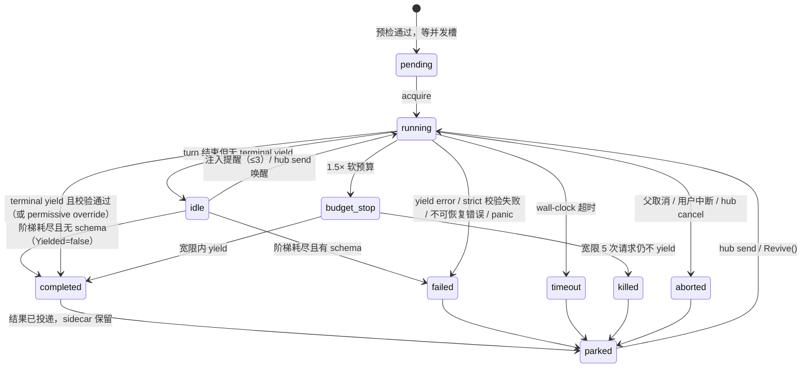

# Phase 9 详细设计：委派运行时（M2 · Delegation Runtime）

> 状态：**待评审** · 日期：2026-08-24 · 所属方案：[2026-08-24-evolution-plan.md](2026-08-24-evolution-plan.md) §9 M2（A3 A5 A6 A8 A9）
> 前置：M1（P8 地基修正）已完成并提交（`phase-8-foundation-fixes` 分支，`aeceba2`/`075e966`/`90717f9`）
> 目标：把"派发"从**一次同步函数调用**升级为**一组有契约、可观察、可干预、寿命受约束的执行单元**——
> 完成度由协议保证（yield 三态 + schema 校验重试 + idle 提醒 + 软预算），可观察性由 EventBus 保证，
> 长任务不再阻塞父 turn（后台作业 + async-result 投递），协作由 hub 邮箱保证，定义由 frontmatter 发现。

---

## 0. 已拍板决策

| # | 决策点 | 结论 | 理由 |
|---|---|---|---|
| 1 | **强制 yield 怎么实现** | 阶梯最后一次重试把子 agent 的工具集换成 **只有 yield 的注册表**（不改 `model.Model` 接口、不用 provider 的 tool choice） | provider 无关、fake model 可测；eino 的 `WithAgenticToolChoice` 留作 M4 可选增强 |
| 2 | **子 agent 始终必须 yield** | 是。turn 结束但没 terminal yield = idle，注入提醒 ≤3 次；阶梯耗尽后：有 outputSchema → `failed`，无 schema → `completed` 且 `Yielded=false`（结果标 `[未 yield]`） | 结构化产出是父 agent 验收的前提；无 schema 的探索型任务不该因为形式问题判失败 |
| 3 | **yield 的线格式** | 扁平三参数 `yield(data?, error?, section?)`，**不用顶层 `anyOf`** | 顶层组合子在 strict provider 上会让整个工具定义被拒（oh-my-pi 注释里的实测坑）；扁平参数对 qwen/deepseek/openai 都安全 |
| 4 | **data 的 wire schema** | 由 outputSchema **递归去掉 `required`** 派生（保留 type/properties/items/enum/description），另加 `additionalProperties: true`；真正的校验（含 required）在工具内做 | 模型能看见目标形状，增量分段又不会在线格式上非法 |
| 5 | **schema 校验失败处置** | 工具内反馈 issue 并要求重试，≤3 次；`permissive`（默认）第 4 次接受并打 warning，`strict` 判 `failed` | 对齐 oh-my-pi `MAX_SCHEMA_RETRIES=3` + schemaMode |
| 6 | **软预算** | `soft_budget` 请求数（只读类 100 / worker 200，可配，0 = 关）；越界注入收尾通知；1.5× 停当前 turn 并强制 yield；再宽限 5 次请求仍不 yield → `killed` | 对齐 oh-my-pi `SOFT_REQUEST_BUDGET` / `BUDGET_STOP_GRACE_REQUESTS` |
| 7 | **后台作业的 ctx 归属** | 后台 Run 挂在 **Manager 自己的根 ctx** 上，不挂 task 工具调用的 ctx | 否则父 turn 一结束（或用户 Esc 停当前 turn）后台作业就被连带取消，"后台"名存实亡 |
| 8 | **async-result 投递时机** | 有活动 run → 走 steering 通道；无活动 run → 由调用方（TUI/headless）起一轮 auto-continue。投递**恰好一次**：`hub jobs` / `hub wait` 观察到已结束的作业即算投递 | 对齐 oh-my-pi "settled row consumes auto-delivery" |
| 9 | **hub 给谁用** | 主 agent（名字固定 `Main`）与所有子 agent 都有；只做协调，不传长内容（长内容走 `agent://` / `artifact://`） | 子 agent 之间确认接口契约是 M2 验收项 |
| 10 | **递归深度与 spawn policy** | `max_recursion_depth` 默认 2；子 agent 只能派 `spawns` 里列出的 agent（空 = 不给 `task` 工具）；禁止派同名 agent | 防"子 agent 无限外包" |
| 11 | **parked / revive** | Run 结束后留在名册里（`parked`，保留 sidecar 路径与产出文件）；`hub send` 或 TUI `/agent <Name> <文本>` 唤醒 = 以**后台作业**方式续跑，结果按 async-result 回投 | 复用后台作业通道，不引入第二套投递语义 |
| 12 | **类型改名** | `SubagentSpec` → `AgentDef`；`Task` → `TaskItem` + 新增 `TaskBatch` | 与演进方案 §A.2 对齐，避免两套词汇 |

**需要在实施前拍板的（默认值已选，异议请在评审时提出）**：

- **未知增量分段标签**：outputSchema 是"封闭对象"（有 `properties` 且未声明 `additionalProperties: true`）时，`section` 必须是其中一个 property 名，否则退回重试。默认**启用**该检查。
- **idle 提醒对"无 schema 且已给出完整文本报告"的 agent 是否也发**：默认**发**（3 次很便宜，且能把文本报告转成结构化 data）。若评审认为浪费，可加 `require_yield: false` frontmatter 开关，本期先不做。

---

## 1. 本阶段产出与边界

### 产出

| 包 | 改动 |
|---|---|
| `internal/bus`（新） | 极简发布/订阅总线：`Publish`/`Subscribe`，非阻塞、订阅者缓冲满即丢 |
| `internal/subagent/spec.go` | `AgentDef`（tools/spawns/model/output/schema_mode/read_only/blocking/soft_budget/source/file_path）、`TaskItem`/`TaskBatch`、`Status` 增 `idle`/`budget_stop`/`parked`、`Result` 增分段/警告/产出文件 |
| `internal/subagent/discovery.go`（新） | frontmatter 发现：项目 `.codeclaw/agents/*.md` → 用户 `~/.codeclaw/agents/*.md` → 内置，同名 first-wins；坏文件告警跳过 |
| `internal/subagent/preflight.go`（新） | 纯函数预检：agent 解析、深度/spawn policy、一行 prompt 拒绝、name 去重与默认命名、schema/模型优先级 |
| `internal/subagent/yield.go` | yield 三态（terminal / incremental / error）+ 由 outputSchema 派生参数 + 工具内校验重试 + 空结果计数 |
| `internal/subagent/schema.go`（新） | 极简 JSON Schema 校验器（type/required/properties/items/enum）+ `deriveDataSchema`（递归去 required） |
| `internal/subagent/driver.go`（新） | 单个 Run 的驱动器：turn 阶梯（idle 提醒 → 强制 yield）、软预算监视、状态机、bus 发布、产出落盘 |
| `internal/subagent/manager.go` | Run 名册（roster）、可 resize 并发闸、根 ctx、`RunBatch`/`StartBackground`/`Jobs`/`Cancel`/`TakeSettled`/`Revive`/`Shutdown` |
| `internal/subagent/mailbox.go`（新） | hub 邮箱：投递、唤醒、等待、未读计数 |
| `internal/subagent/hub.go`（新） | `hub` 工具：`list`/`send`/`inbox`/`wait`/`jobs`/`cancel` |
| `internal/subagent/task.go` | `task` 工具：`{context, tasks[], background}`、动态 agent 枚举（含 READ-ONLY/BLOCKING 标记）、结果渲染带指针 |
| `internal/tool/tool.go`、`executor.go` | `Terminal` 接口改为**按调用**判定 `IsTerminal(args, err) bool`；`Result` 增 `Terminal bool` |
| `internal/agent/loop.go` | 终止判定改读 `Result.Terminal`（不再查注册表） |
| `internal/runtime/artifact.go` | `AddScheme(scheme, resolver)`：让 `read_file` 能读 `agent://<Name>`、`history://<Name>` |
| `internal/paths/paths.go` | `UserAgentsDir()`、`ProjectAgentsDir(cwd)` |
| `internal/tui` | Agent Hub 面板（`ctrl+a`）、`/agent <Name> <文本>` 转发/唤醒、后台作业完成行、bus 订阅桥 |
| `cmd/agent/main.go`、`headless.go`、`config.go` | 装配 bus/名册/scheme；`subagent` 配置段扩展；headless 支持后台作业结算与 auto-continue |
| `docs/DEVELOPMENT_LOG.md`、`example.yaml`、`.codeclaw/agents/*.md` 示例 | 记录与示例 |

### 不做（留给 M3/M4）

- 记忆 v2 / FTS 清洗 / file_notes / 项目地图（M3）
- L6 剪枝 / shake / split-turn / 压缩后恢复文件（M3）
- 审批规则引擎 / bash 分类器 / edit 工具 / hooks（M4）
- worktree 隔离、`effort` 真正影响模型参数（M4；本期 `effort` 只记录进 `session_init` 供审计）
- trace.db 派生索引与 `codeclaw stats`（M4）
- Workflow 脚本编排、advisor/watchdog、完整 IRC peer（后置）
- `hub start/ps/logs/stop`（长驻进程托管）——本期 hub 只做 agent 协调，不管进程

### 验收（可观察行为）

1. **不阻塞**：`task{background:true}` 派 3 个子 agent → 工具立刻返回 3 个 job id；主 agent 在子 agent 仍在跑时能回答用户追问；作业完成后主会话出现 `[后台作业完成]` 并自动继续。
2. **可观察**：`ctrl+a` 打开 Agent Hub，能看到每个 Run 的 status / 当前工具 / requests / tokens；结束后变 `parked` 仍在列表里。
3. **协作**：两个子 agent 通过 `hub send` 确认接口契约（A 定 signature，B 收到后按同一 signature 实现），产出一致。
4. **schema 闭环**：outputSchema 要求 `{findings:[], verdict}` 时，第一次 yield 给错形状 → 工具返回 issue 与剩余重试次数 → 第二次通过；`strict` 模式下 3 次都错 → `failed` 且带 `schema_violation`。
5. **追问已完成的子 agent**：`/agent Reviewer 再核对一下 X` → parked 的 Reviewer 被唤醒续跑，补充结论以 async-result 回到主会话。
6. **idle 提醒**：脚本化 fake model 永不调 yield → 恰好 3 次提醒（最后一次工具集只有 yield），随后 `completed(未 yield)` 或 `failed`（有 schema）。
7. **软预算**：`soft_budget: 4` 的 agent 不停调工具 → 第 4 次请求后收到收尾通知；第 6 次（1.5×）当前 turn 被停并强制 yield；仍不 yield 则 5 次请求后 `killed`。
8. **frontmatter 发现**：在 `<project>/.codeclaw/agents/reviewer.md` 放一个同名定义 → `task` 工具描述里的 reviewer 换成项目版；写坏一个文件只告警，其它 agent 照常可用。
9. **预检**：一行 prompt（<40 字符）派发被拒绝并说明要写 Target/Change/Acceptance；`explorer`（read_only）拿不到 write/bash；深度 2 的子 agent 没有 `task` 工具。
10. `env -u GOROOT go build ./... && go vet ./... && go test ./...` 全绿。

---

## 2. AgentDef 与 frontmatter 发现

### 2.1 类型

```go
// internal/subagent/spec.go
type AgentDef struct {
    Name         string        // 唯一 id（大小写敏感）
    Description  string        // 一句话，进 task 工具描述
    WhenToUse    string        // 使用边界
    SystemPrompt string        // frontmatter 之后的正文
    Tools        []string      // 限定工具名；空 = worker 默认集
    Spawns       []string      // 可再派发的 agent；空 = 不给 task 工具
    Model        string        // 预留：模型别名/ID（M2 只记录，装配层可选生效）
    OutputSchema map[string]any
    SchemaMode   string        // permissive（默认）| strict
    MaxTurns     int           // 单 turn 工具循环上限（默认 config.default_max_turns）
    SoftBudget   int           // 累计模型请求软预算（0 = 关）
    Timeout      time.Duration // wall-clock
    ReadOnly     bool          // 工具集裁到 read_file/glob/grep（+yield/hub）
    Blocking     bool          // background 批次里仍内联等待
    Source       string        // bundled | user | project
    FilePath     string
}
```

### 2.2 文件格式

```md
---
name: reviewer
description: 代码审查
when_to_use: 非平凡实现/改动后验收
tools: read_file, glob, grep          # CSV 或 YAML 数组；省略 = 默认集；yield/hub 自动加
spawns: []                            # 省略/空 = 不可再派发
read_only: true
blocking: false
max_turns: 40
soft_budget: 100
timeout: 10m
schema_mode: strict
output:                               # JSON Schema（进 yield 的 data 参数与校验器）
  type: object
  properties:
    findings:
      type: array
      items:
        type: object
        properties:
          file: {type: string}
          severity: {type: string, enum: [crit, high, med, low]}
          summary: {type: string}
        required: [file, severity, summary]
    verdict: {type: string}
  required: [findings, verdict]
---
你是代码审查专家：核对改动是否满足任务的验收标准……
```

解析规则：

- 文件必须以 `---\n` 开头，第二个 `---` 行结束 frontmatter；用 `yaml.v3` 反序列化。
- `name`、`description`、正文（`SystemPrompt`，trim 后非空）三者缺一即视为无效 → 记 error、跳过该文件。
- `tools`/`spawns` 同时接受 CSV 字符串与数组；`spawns: "*"` = 允许全部（仍受深度限制）。
- `timeout` 走 `time.ParseDuration`；非法值记 error 并用默认值（不丢整个文件）。
- 未识别的字段忽略（向前兼容 oh-my-pi/Claude Code 的额外字段）。

### 2.3 发现与优先级

```go
// internal/subagent/discovery.go
type DiscoverResult struct {
    Defs  []AgentDef
    Warns []error // 每个坏文件一条，装配层打印一次
}

// Discover 按 project → user → bundled 顺序合并，同名 first-wins；每个目录内按文件名字典序。
func Discover(projectAgentsDir, userAgentsDir string, bundled []AgentDef) DiscoverResult

// ParseAgentFile 解析单个 markdown 定义（纯函数，测试直接喂字符串）。
func ParseAgentFile(path string, data []byte, source string) (AgentDef, error)
```

`paths` 增两个函数：`UserAgentsDir() (string, error)` = `<Home>/agents`；`ProjectAgentsDir(cwd) string` = `<cwd>/.codeclaw/agents`。目录不存在按空处理。

内置四个（`explorer` / `reviewer` / `planner` / `worker`）改为**嵌入的 markdown**（`internal/subagent/agents/*.md` + `go:embed`），这样内置与用户定义走同一条解析路径，内置 prompt 也不再挤在 `main.go` 里。内置定义带 outputSchema（explorer/reviewer/planner 三个原本在 prompt 里用自然语言描述的字段，现在变成真的 schema）。

---

## 3. 派发契约：TaskBatch 与预检

### 3.1 类型与线格式

```go
type TaskItem struct {
    Name         string         // 稳定名：hub 寻址 / agent:// / sidecar 文件名；缺省 <Agent>-<seq>
    Agent        string
    Task         string         // Target / Change / Acceptance
    OutputSchema map[string]any // 覆盖 agent 定义
    SchemaMode   string
    Effort       string         // lo|med|hi（M2 只审计）
}

type TaskBatch struct {
    Context    string     // Goal / Constraints / Contract，整批共享
    Tasks      []TaskItem
    Background bool
}
```

`task` 工具参数（保持扁平、无顶层组合子）：

| 参数 | 类型 | 说明 |
|---|---|---|
| `context` | string（必填） | 整批共享的 Goal / Constraints / Contract |
| `tasks` | array（必填） | 每项 `{name?, agent, task, output_schema?, schema_mode?, effort?}` |
| `background` | boolean | `true` = 立即返回 job id，完成后自动投递；默认 `false` |

### 3.2 预检（纯函数，先于任何子进程）

```go
// internal/subagent/preflight.go
type Env struct {
    Defs        []AgentDef
    Depth       int      // 当前调用者深度（主 agent = 0）
    MaxDepth    int      // 默认 2
    Spawns      []string // 调用者可派发的 agent；主 agent = nil（无限制）
    SelfAgent   string   // 调用者自己的 agent 名（防同名递归）；主 agent = ""
    MinTaskChars int     // 默认 40
    SeqNext     func(agent string) string // 默认命名器
}

type Resolved struct {
    Item TaskItem
    Def  AgentDef
    Schema map[string]any
    SchemaMode string
}

func Preflight(b TaskBatch, env Env) ([]Resolved, error)
```

检查顺序（任一失败整批拒绝，返回给模型的错误文本要能自我修正）：

1. `len(b.Tasks) == 0` → `tasks 必填`。
2. `strings.TrimSpace(b.Context) == ""` → `context 必填：写清 Goal / Constraints / Contract（子 agent 看不到你的历史）`。
3. `env.Depth >= env.MaxDepth` → `已达最大委派深度 N，请自己完成`。
4. 每项：`agent` 未知 → `unknown agent "x"; available: a, b, c`。
5. 每项：`env.Spawns != nil` 且 agent 不在其中 → `不能派发 "x"，允许：…`；`agent == env.SelfAgent` → `禁止派发同名 agent`。
6. 每项：`len([]rune(task)) < MinTaskChars` → `任务描述太短：必须写明 Target（文件/符号与非目标）、Change（步骤）、Acceptance（可观察结果）`。
7. `name`：sanitize 到 `[A-Za-z0-9_-]`；同批内重复或与名册中 running 的重名 → 加 `-2`/`-3` 后缀；缺省 = `SeqNext(agent)`。
8. schema 优先级：`item.OutputSchema` > `def.OutputSchema`；mode 同理，缺省 `permissive`。

### 3.3 工具集与权限（每个 Run 一份）

```
tools = base ∪ {yield, hub}
base  = def.Tools 指定的子集；def.Tools 为空 → worker 默认集
def.ReadOnly → base ∩ {read_file, glob, grep}
def.Spawns 非空 且 depth+1 < MaxDepth → + task（depth+1，spawns 限定）
否则 → 无 task
```

审批：沿用 M1 的"继承父 mode + `denyApprover` / `labeledApprover`"，不变。

`task` 工具描述动态枚举，每个 agent 一行：`name（描述，用于<边界>）[READ-ONLY][BLOCKING][schema]`，并固定带上三句硬约束（自包含 prompt / yield 提交 / completed≠验收）。

---

## 4. yield 三态与 schema 校验

### 4.1 线格式与语义

```
yield(data?: <派生 schema>, error?: string, section?: string)
```

| 组合 | 语义 | 是否终止 |
|---|---|---|
| `data` 有、`section` 无 | **terminal success**：提交最终产出 | ✅ |
| `data` 有、`section` 非空 | **incremental**：提交一段（`section` 是分段名），累积到 `Sections[section]` | ❌（返回"已记录该段，继续工作，完成后不带 section 再调一次"） |
| `error` 非空 | **error yield**：主动放弃并说明卡在哪 | ✅ |
| `data`、`error` 都有 | 参数错误 → 退回重试 | ❌ |
| 都没有，但已有累积分段 | terminal：用分段装配最终 data | ✅ |
| 都没有且无分段 | 空结果：计数 ≤3，第 4 次直接 `failed`（避免无限等待） | 第 4 次 ✅（判失败） |

`Terminal` 由本次调用决定，因此 `tool.Terminal` 接口改签名：

```go
// internal/tool/tool.go
// Terminal 可选接口：本次调用是否终止 run（yield 的增量提交不终止）。
type Terminal interface{ IsTerminal(args map[string]any, err error) bool }

// internal/tool/executor.go
type Result struct {
    Content  string
    IsError  bool
    Terminal bool // 本次调用要求终止 run
}
```

`agent.loop` 的终止判定从"查注册表 + 静态 `IsTerminal()`"改为直接读 `results[i].Terminal`（更简单，也顺手修掉"注册表里同名工具被替换后判定失真"的隐患）。

### 4.2 状态与校验

```go
// YieldState 由 Run 持有，yield 工具写、驱动器读。
type YieldState struct {
    mu               sync.Mutex
    Data             any               // terminal data（或分段装配结果）
    Sections         map[string][]any  // 增量分段（按提交序）
    Error            string            // error yield
    Terminal         bool
    SchemaOverridden bool              // permissive 下超重试次数被放行
    Issues           []string          // 最后一次校验问题（审计）
    schemaFailures   int
    emptyFailures    int
}
```

```go
// internal/subagent/schema.go
// Validate 校验 value 是否符合 schema，返回人类可读的问题列表（空 = 通过）。
// 支持：type(object/array/string/number/integer/boolean/null)、required、properties（递归）、items、enum。
// 不支持（忽略并在文档里声明）：$ref、oneOf/anyOf/allOf、format、pattern、min/max。
func Validate(schema map[string]any, value any) []string

// deriveDataSchema 由 outputSchema 派生 yield 的 data 参数 schema：递归删除 required，
// 对象层加 additionalProperties:true；nil → {type:object}。
func deriveDataSchema(s map[string]any) map[string]any

// sectionSchema 取 schema.properties[label]（数组类型取 items），供增量校验。
func sectionSchema(s map[string]any, label string) (map[string]any, bool)
```

校验流程（terminal success）：

1. `Validate(schema, data)` 通过 → 记录、终止。
2. 不通过 → `schemaFailures++`；`<= 3` 时**返回 error 给模型**（含问题列表 + 剩余次数 + "调 yield 重交"），不终止。
3. 第 4 次：`permissive` → 接受 + `SchemaOverridden=true`（结果里带 warning）；`strict` → 记录 data、`Terminal=true`，驱动器判 `failed`（原因 `schema_violation`）。

校验流程（incremental）：`sectionSchema` 命中则校验该段（数组属性用 items），未命中：封闭 schema → 退回"未知分段名，可用：…"；开放 schema → 放行。

装配（`data` 省略但有分段）：对每个分段名，若 schema 里该属性是数组 → 用累积数组；否则取最后一次提交值。装配后再整体 `Validate` 一次，走同一套重试/override 规则。

### 4.3 描述

yield 的 description 动态生成：无 schema 时说明"data 为自由结构"；有 schema 时内联 schema JSON（≤2KB，超出只留顶层字段名）并列出可用分段名。

---

## 5. 驱动器：turn 阶梯 · 软预算 · 状态机

### 5.1 一个 Run 的驱动循环

```
准备：bash(cwd) / artifactStore / tools+yield+hub(+task) / executor(继承审批)
      sidecar session(session_init: agent/task/tools/schema/depth/parentToolCallID/effort)
      cc = context.New(sidecar, summarizer, window, keep, system)
      Record(user: <Context 段> + <Task 段>)

for {
    turnCtx, turnCancel = WithCancel(runCtx)
    events = agentFor(forced).Run(turnCtx, run.steer)
    consume(events):            // 同时做 bus 发布、requests 记账、预算判定
        EventMessageEnd  → requests++ ; usage += ; budget 检查
        EventToolStart   → currentTool = name ; toolCalls++
        EventToolEnd     → currentTool = ""
        EventTerminated  → terminal = true
        EventError       → runErr = err
    turnCancel()

    if terminal(yieldState) || runCtx.Err() != nil || hardKilled { break }
    if reminders >= 3 { break }                       // 阶梯耗尽
    reminders++
    forced = (reminders == 3) || budgetStop            // 最后一次 / 预算停机：只给 yield
    Record(user: 提醒文本(reminders, forced, budgetStop))
}
结算：状态判定 → 落盘 agent://<Name> → session_exit → bus lifecycle
```

要点：

- **每个 turn 一个 `turnCtx`**：软预算停机 / yield 增量停机只取消当前 turn，不杀 Run；硬杀取消 `runCtx`。
- 取消当前 turn 可能在会话里留下未配对的 tool_call —— M1 的回放修复（合成 `[interrupted]` 结果）已经覆盖，不需要额外处理。
- 消费者必须**把事件通道读到关闭**再进入下一 turn（`agent.Run` 的 goroutine 在通道关闭时才结束），否则会出现两轮并发写同一 session。
- `forced` 用 `agent.New(name, model, yieldOnlyRegistry, yieldOnlyExecutor, cc)` 现场构造，与主 Agent 共享同一个 `cc`（Agent 是薄结构，重建代价可忽略）。

### 5.2 预算与提醒常量

```go
const (
    maxYieldReminders    = 3   // idle 提醒次数（第 3 次 = 只给 yield）
    budgetStopMultiplier = 1.5 // 停机阈值 = soft × 1.5
    budgetGraceRequests  = 5   // 停机后仍不 yield 的宽限请求数 → killed
    maxSchemaRetries     = 3
    maxEmptyYieldRetries = 3
)
```

`soft_budget` 缺省：`read_only` agent 100，其它取 `config.subagent.soft_budget`（默认 200）；配置只能**下调**不能上调 frontmatter 的值（与 oh-my-pi 一致，避免定义被配置放大）。

| 触发 | 动作 | 模型看到什么 |
|---|---|---|
| `requests == soft` | 往 `steer` 推收尾通知（非阻塞，下一步生效） | `[预算提醒] 已用 N 次请求（软预算 M）…到 K 次会被强制收尾` |
| `requests >= soft*1.5` | `budgetStop = true`；`turnCancel()`；下一 turn 只给 yield | `[强制收尾] 本轮已停止，现在只能调用 yield…` |
| 停机后 `requests >= soft*1.5 + 5` | `runCancel()`，状态 `killed` | 无（父看到 `killed` + partial） |

### 5.3 状态机



判定优先级（与 M1 一致，新增两条）：父 ctx 取消 → `aborted`；`runCtx` 超时 → `timeout`；硬杀 → `killed`；`runErr` → `failed`；yield error → `failed`（`Err = errors.New(yield.Error)`）；strict 且 schema 未过 → `failed`；terminal yield → `completed`；阶梯耗尽 → 有 schema `failed` / 无 schema `completed(Yielded=false)`。

### 5.4 Result 扩展

```go
type Result struct {
    ID, Name, Agent string
    Status   Status
    Yielded  bool
    Data     map[string]any
    Sections map[string][]any
    Text     string   // 最后一段 assistant 文本（partial）
    Err      error
    Warning  string   // schema override / 未 yield 等
    Usage    model.Usage
    Requests, ToolCalls, Reminders int
    BudgetStopped bool
    DurationMs  int64
    SessionFile string // history://<Name>
    OutputFile  string // agent://<Name>
}
```

给父 agent 的渲染：一段头部（`## Name (agent) [status] requests=… tokens=… 12.3s`）+ data JSON（>8000 字符时只给顶层字段摘要 + `agent://<Name>` 指针）+ 失败时 `error:` 与 `[partial]` + 两个指针行。

---

## 6. EventBus 与 Agent Hub

### 6.1 bus

```go
// internal/bus/bus.go —— 只依赖 sync/time
type Envelope struct {
    Channel string
    Payload any
    At      time.Time
}

type Bus struct { /* mu sync.RWMutex; subs map[string]map[int]chan Envelope; seq int */ }

func New() *Bus
// Publish 非阻塞：某订阅者缓冲满则丢弃这一条（渲染事件可丢，持久化不依赖 bus）。
func (b *Bus) Publish(channel string, payload any)
// Subscribe 返回只读通道与幂等的取消函数（取消时注销并关闭通道）。
func (b *Bus) Subscribe(channel string, buf int) (<-chan Envelope, func())
```

并发不变量：`Publish` 持 RLock 期间不会有 `close`（`unsubscribe` 需要写锁），因此不会向已关闭通道发送。

### 6.2 通道与载荷（定义在 `subagent`）

```go
const (
    ChLifecycle = "subagent.lifecycle"
    ChProgress  = "subagent.progress"
    ChEvent     = "subagent.event"
    ChJob       = "job.settled"
    ChMailbox   = "hub.message"   // 给 Main 的消息到达（TUI 提示用）
)

type Lifecycle struct { RunID, Name, Agent, Status, SessionFile, ParentCallID string; Depth int }
type Progress  struct { RunID, Name, CurrentTool string
                        Requests, ToolCalls, Tokens, ContextTokens int
                        Reminders, SchemaRetries int; BudgetStop bool }
type SubEvent  struct { RunID, Name string; Event agent.AgentEvent }
type JobSettled struct { JobID, Name, Status, Summary string }
type MailArrived struct { To, From, Text string }
```

发布点：Run 状态变化 → `ChLifecycle`；`EventMessageEnd`/`EventToolStart`/`EventToolEnd` → `ChProgress`（同一 Run 相邻 100ms 内合并，最后一条必发）；原始事件 → `ChEvent`（供未来"聚焦子 agent 转录"，M2 的 TUI 只订阅前两个）。

**父 agent 不消费 bus**（避免子 agent 的原始事件污染父上下文）——只有 TUI 与 Manager 消费。

### 6.3 TUI Agent Hub（最小可用）

- `ctrl+a` 开/关面板（modal 之外的第二个覆盖层；审批弹窗优先级更高）。
- 行：`<状态图标> <Name> [<agent>] <status> req=N tools=M tok=K <当前工具> <age>`；表头聚合 running/parked 数与总 token。
- 键：`j/k`（选择）、`x`（取消所选 running Run / job）、`esc`（关闭）。
- `/agent <Name> <文本>`：running → steering；idle/parked → 唤醒（后台作业），并在聊天区落一行 `→ <Name>: …`。
- 后台作业完成时聊天区插入 `── 后台作业完成：<Name> [<status>] ──`，随后自动继续（见 §7）。
- 订阅桥：`NewModel` 拿到 `*bus.Bus` 与 `*subagent.Manager`，起一个 goroutine 订阅 `ChLifecycle`/`ChProgress`/`ChJob`，收到就 `program.Send(hubTickMsg{})`（面板渲染时直接读 `mgr.Roster()` 快照，避免在 TUI 里维护第二份状态）。

---

## 7. 后台作业与 async-result 投递

### 7.1 Manager API

```go
type JobInfo struct {
    ID, Name, Agent string
    Status  string      // running | completed | failed | timeout | killed | aborted
    Started time.Time
    Settled time.Time   // 零值 = 未结束
    Summary string      // 结束后的一行摘要
}

func (m *Manager) RunBatch(ctx context.Context, b TaskBatch, env Env) ([]Result, error)      // 同步（含 Blocking agent）
func (m *Manager) StartBackground(b TaskBatch, env Env) ([]JobInfo, error)                    // 立即返回；Run 挂 m.root
func (m *Manager) Jobs() []JobInfo                                                            // 快照；已结束行**同时消费投递**
func (m *Manager) Cancel(ids []string) int
func (m *Manager) TakeSettled() []JobResult    // 取走已结束且未投递的结果（一次性）
func (m *Manager) Pending() int
func (m *Manager) Roster() []RunView
func (m *Manager) Revive(name, text string) (JobInfo, error)
func (m *Manager) Shutdown(grace time.Duration)  // 取消 root，等所有 Run 退出
```

- `background:true` 且批次里有 `Blocking` agent：blocking 的那几项内联等待并直接返回结果，其余转后台（对齐 oh-my-pi）。
- 结算时：写 `agent://<Name>`、发 `ChLifecycle(parked)`、发 `ChJob`，并把 `JobResult` 放进"待投递"队列。
- **恰好一次投递**：`TakeSettled()` 与 `Jobs()`（以及 `hub wait` 观察到的结束行）共用同一个"未投递"集合，谁先看到谁消费。

### 7.2 投递路径

| 场景 | 路径 |
|---|---|
| 主 agent 有活动 run | TUI/headless 把 `message.NewUserMessage(asyncResultText)` 推进 `currentSteer` → 下一步模型调用可见 |
| 主 agent 空闲 | 起一轮 auto-continue：`cmgr.Record(asyncResultText)` + `agent.Run`，聊天区先落一行提示 |
| 子 agent 是 owner（嵌套派发） | 推进该 Run 的 `steer`；Run 已 parked → 作为唤醒消息排队，下次 revive 时带上 |

`asyncResultText` 模板（对齐 oh-my-pi `async-result.md`）：

```
<system-notice>
后台作业 <id>（<Name>）已完成。用下面的结果继续你的工作。
<结果渲染，同 task 工具的单项格式>
</system-notice>
```

headless（`-p`）：一轮结束后若 `mgr.Pending() > 0` → 等待（上限 = `--wait-jobs`，默认 `subagent.default_timeout`）→ `TakeSettled()` → 打印并 auto-continue，最多 3 轮，避免 CI 里无限循环。

---

## 8. hub：邮箱与唤醒

```go
// hub 工具参数
type hubArgs struct {
    Op      string   `json:"op"`      // list | send | inbox | wait | jobs | cancel
    To      string   `json:"to"`      // Run Name 或 "Main" 或 "all"
    Text    string   `json:"text"`
    ReplyTo string   `json:"replyTo"`
    IDs     []string `json:"ids"`     // cancel / wait 的 job id
    Timeout int      `json:"timeout"` // wait 秒数，默认 30，上限 120
}
```

| op | 语义 | 返回 |
|---|---|---|
| `list` | 名册（自己以外的 peer）：Name / agent / status / 当前工具 / 未读数 | 表格文本 |
| `send` | 投递到目标邮箱：running → 推 steer；idle → 推 steer（唤醒下一 turn）；parked → 起 revive 后台作业 | `delivered to X` / `failed: no such peer` |
| `inbox` | 非阻塞清空自己的邮箱 | 消息列表（含 from/replyTo） |
| `wait` | 阻塞到"第一个事件"：新消息 / 被 watch 的 job 结束 / 超时 / ctx 取消 | 触发原因 + 内容 |
| `jobs` | 作业快照（已结束行同时消费投递） | 表格 + 已结束项的结果摘要 |
| `cancel` | 按 id 取消作业 | 取消数量 |

- 邮箱：`map[string]*mailbox`，`mailbox{mu, msgs []Mail, unread int, waiters []chan struct{}}`；名字大小写敏感，`Main` 保留给主 agent。
- **只做协调**：description 里明确"禁止用 hub 传长内容/粘贴文件，长内容用 `agent://` / `artifact://` / 文件路径"，且"能用工具查到的事情不要问 peer"。
- `send` 的文本作为 `[hub from <From>] <Text>` 记进目标会话（steering 用户消息），因此可审计。
- `wait` 的实现：`select { case <-mailWake: ; case <-jobWake: ; case <-time.After(d): ; case <-ctx.Done(): }`。

**parked → revive**：`Revive(name, text)` 重开 sidecar（`session.Open(FileStorage(path))`）→ 重建工具/cc/YieldState（新的）→ `Record(user: text)` → 走同一个驱动循环 → 结算按后台作业投递。名册里该 Run 的 ID 不变，`Revives++`。

---

## 9. 产出落盘与内部 URL

| URL | 落点 | 读法 |
|---|---|---|
| `agent://<Name>` | `<sessionDir>/<Name>.md`：头部元信息 + data JSON + 分段 + 最后文本 | `read_file file_path="agent://Reviewer"` |
| `history://<Name>` | `<sessionDir>/agent-<Name>-<rand>.jsonl`（sidecar） | 同上（按行读，默认 300 行） |
| `artifact://<N>` | M1 已有 | 不变 |

```go
// internal/runtime/artifact.go
// AddScheme 注册一个额外的 URL 方案（如 agent:// history://）；重复注册后者覆盖。
func (s *ArtifactStore) AddScheme(scheme string, resolve func(rest string) (string, error))
// Resolve 按 "<scheme>://" 前缀分派；无匹配前缀时按 artifact id 处理（兼容 M1）。
func (s *ArtifactStore) Resolve(ref string) (string, error)
```

`read_file` 改为"含 `://` 就交给 store 解析"，并在没有 store 时给出清晰错误。装配层（`cmd/agent`）把 `agent`/`history` 两个 scheme 指向 `mgr.ResolveAgentURL` / `mgr.ResolveHistoryURL`（名册里查 Name，parked 也能查到；查不到时回落到目录 glob，支持 resume 后读旧 Run）。

---

## 10. 配置与命令行

```yaml
subagent:
  max_concurrency: 4          # 可运行时 resize（Hub 里不做 UI，保留 API）
  approval_escalation: false
  default_timeout: 10m
  default_max_turns: 50
  soft_budget: 200            # 0 = 关闭预算护栏；只能下调 frontmatter 的值
  max_recursion_depth: 2
  min_task_chars: 40
  background: true            # false = 忽略 task 的 background 参数（全部同步）
  agents_dir: ""              # 额外的 agent 定义目录（最高优先级，调试用）
```

命令行新增：`--wait-jobs <dur>`（headless 等后台作业的上限，默认取 `default_timeout`）。

---

## 11. 兼容与迁移

- `SubagentSpec` → `AgentDef`、`Task` → `TaskItem`：内部类型，无外部使用者；`cmd/agent/main.go` 的 `builtinDefs` 被嵌入 markdown 取代。
- `task` 工具的参数从 `{tasks:[{subagent,prompt}]}` 变成 `{context, tasks:[{agent,task}], background}`：**破坏性变更**，但只影响模型看到的工具定义，不影响历史会话回放（旧 tool_call 的 args 只是文本）。为降低旧会话续聊时模型照旧格式调用的概率，`task` 执行时对 `subagent`/`prompt` 两个旧字段名做一次兼容映射，并在结果里提示新字段名。
- 旧 sidecar 文件名格式不变（`agent-<Name>-<rand>.jsonl`），resume 后能被名册扫描为 parked 行。
- `tool.Terminal` 接口签名变更：唯一实现是 yield，`loop.go` 是唯一消费者。

---

## 12. 测试策略（harness 行为回归，全部用 fake model）

`scriptModel`（M1 已有）扩展为可按"第 N 次调用"返回不同事件、可断言收到的工具定义列表（用于验证强制 yield 时只有 yield）。

| 组 | 用例 |
|---|---|
| 发现 | frontmatter 解析（全字段 / CSV tools / 缺 name / 坏 YAML / 非法 timeout）；project 覆盖 user 覆盖 bundled；坏文件只告警 |
| 预检 | 空 tasks / 空 context / 一行 prompt / 未知 agent / 深度上限 / spawns 不允许 / 同名递归 / name 去重与默认命名 |
| schema | `Validate` 正例反例（嵌套 object/array/enum/required）；`deriveDataSchema` 去 required 且保留结构；`sectionSchema` 命中数组 items |
| yield 三态 | terminal 终止；incremental 不终止且累积；error yield → failed；data+error 同时 → 退回；空结果 3 次后 abort |
| schema 重试 | 错 3 次后：permissive 接受 + warning；strict → failed(schema_violation)；第 2 次改对 → completed |
| 阶梯 | 永不 yield → 恰好 3 次提醒；第 3 次的工具定义只有 yield；耗尽后无 schema=completed(未 yield) / 有 schema=failed |
| 预算 | soft=4：第 4 次请求后 steer 收到通知；第 6 次 turn 被停并进入强制 yield；强制后 yield → completed(BudgetStopped=true)；仍不 yield → killed |
| 状态机 | timeout / 父取消 / panic recover / hub cancel 各自的状态与 partial 保留 |
| bus | 多订阅者各收一份；缓冲满丢弃不阻塞；unsubscribe 后 Publish 不 panic |
| 后台作业 | `background:true` 立即返回 job id 且 `Pending()>0`；结算后 `TakeSettled()` 只返回一次；`Jobs()` 消费投递后 `TakeSettled()` 为空 |
| hub | send 到 running（steer 收到）/ 到 parked（起 revive 作业）/ 到不存在（failed）；inbox 清空；wait 被消息唤醒 / 超时；list 不含自己 |
| revive | parked Run 被唤醒后 sidecar 追加了新的 user/assistant 条目，且 Result 是新的 |
| URL | `agent://Name` / `history://Name` 能被 read_file 读到；未知 Name 报错清晰 |
| 端到端（headless） | `-p` + fake provider 不可用时跳过；改为对 `runHeadless` 的投递逻辑做单测（Pending → 等待 → auto-continue ≤3 轮） |

---

## 13. 分期与验收映射

| 子阶段 | 内容 | 对应验收 |
|---|---|---|
| **P9.1 契约与发现** | `bus`；`AgentDef` + frontmatter 发现 + 内置 agent 嵌入；`TaskBatch` + 预检 + 工具集/深度/只读 | 验收 8、9 |
| **P9.2 完成度** | `Result.Terminal` 重构；yield 三态 + schema 派生/校验/重试；驱动器阶梯 + 软预算 + 状态机 | 验收 4、6、7 |
| **P9.3 可观测** | Run 名册 + bus 发布 + 产出落盘 + `agent://`/`history://`；TUI Agent Hub + `/agent` | 验收 2 |
| **P9.4 异步与通信** | 后台作业 + async-result 投递（TUI/headless）；hub 工具 + 邮箱 + parked/revive；可 resize 并发闸 | 验收 1、3、5 |

每个子阶段结束：`go build ./... && go vet ./... && go test ./...` 全绿 + 一次提交；P9.2 与 P9.4 结束各做一次真实模型下的手动冒烟（`--yolo -p`）。

---

依据：`my_code_agent` 现状代码（`internal/subagent/{manager,task,yield,approver,spec}.go`、`internal/agent/{loop,agent,event}.go`、`internal/tool/{tool,executor,registry}.go`、`internal/tui/tui.go`、`cmd/agent/{main,headless,config}.go`）；oh-my-pi `docs/{agent-hub,task-agent-discovery}.md`、`packages/coding-agent/src/tools/yield.ts`、`src/task/executor.ts`（`SOFT_REQUEST_BUDGET` / `BUDGET_STOP_GRACE_REQUESTS` / `MAX_YIELD_RETRIES` / yield ladder）、`src/prompts/tools/{hub,async-result,task-async-contract}.md`；Claude Code 的 Agent + `run_in_background` + SendMessage 行为面；einoclaw `docs/子Agent与后台任务.md`。
